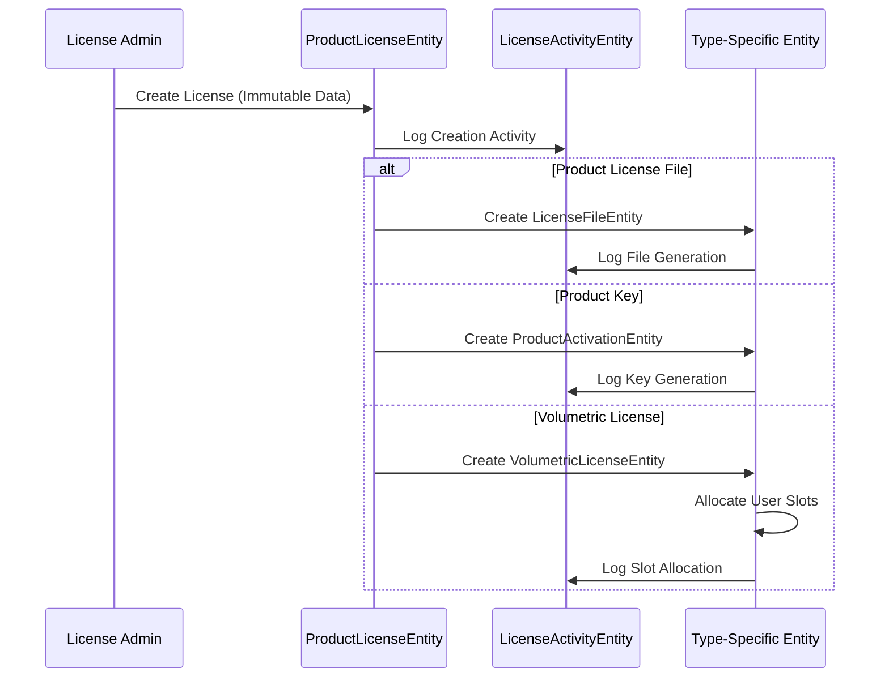
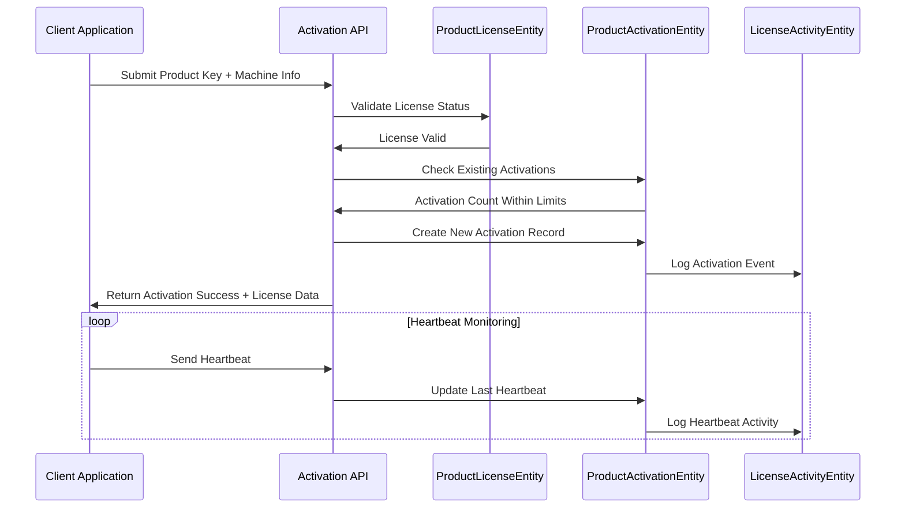
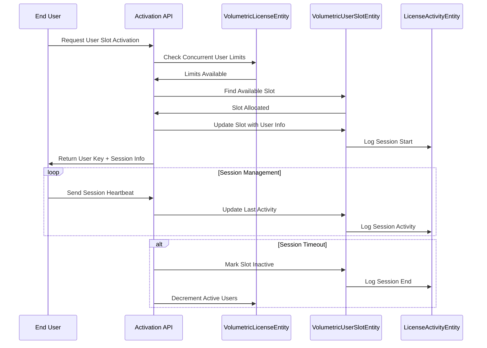

# License Activation System - Comprehensive Documentation

## Overview

This document provides complete documentation for the License Activation System architecture, designed to support three distinct license types with sophisticated activation, tracking, and management capabilities. This documentation is critical for future implementation phases and serves as the definitive reference for the activation system design.

**Document Version:** 1.0  
**Date:** August 21, 2025  
**Status:** Design Complete - Ready for Implementation

---

## Table of Contents

1. [System Architecture](#system-architecture)
2. [License Types & Activation Models](#license-types--activation-models)
3. [Entity Model Documentation](#entity-model-documentation)
4. [Activation Flow Processes](#activation-flow-processes)
5. [Security & Compliance Framework](#security--compliance-framework)
6. [Implementation Guidelines](#implementation-guidelines)
7. [API Design Specifications](#api-design-specifications)
8. [Performance & Scalability Considerations](#performance--scalability-considerations)
9. [Future Implementation Roadmap](#future-implementation-roadmap)

---

## System Architecture

### Core Design Principles

#### 1. **Separation of Immutable vs Mutable Data**
```
ProductLicenseEntity (Immutable Core)
    ↓
LicenseActivityEntity (Mutable Tracking)
    ↓
Type-Specific Entities (Specialized Logic)
```

- **Immutable Core**: `ProductLicenseEntity` contains license data that never changes after creation
- **Mutable Tracking**: `LicenseActivityEntity` handles all changeable data, usage patterns, and audit trails
- **Specialized Logic**: Type-specific entities handle activation logic for each license type

#### 2. **Multi-Tenant Security Architecture**
- All entities include `tenant_id` for complete isolation
- Global query filters ensure tenant data security
- Machine fingerprinting and hardware binding for device security
- Complete audit trails for compliance and forensics

#### 3. **Comprehensive Activity Tracking**
- Every action tracked in `LicenseActivityEntity` with 42 distinct activity types
- Real-time counters and session management
- Machine identification and IP address logging
- Session lifecycle tracking with heartbeat monitoring

---

## License Types & Activation Models

### 1. Product License Files (Offline Activation)

#### **Purpose & Use Cases**
- Software deployed in air-gapped environments
- Applications with limited internet connectivity
- Offline validation using cryptographic signatures
- Desktop applications requiring file-based licensing

#### **Technical Implementation**
```
ProductLicenseEntity
    ↓
LicenseFileEntity
    ↓
File Download & Validation Process
```

#### **Key Features**
- **File Formats**: JSON/XML license files with cryptographic signatures
- **Download Management**: Controlled file access with download limits
- **Version Control**: File versioning and update management
- **Security**: SHA-256 hashing and encryption support
- **Expiration**: Time-based file access expiration

#### **Activation Flow**
1. License created with file generation
2. Customer downloads license file
3. Application validates file signature offline
4. Usage tracked through periodic sync (optional)

### 2. Product Keys (Online Activation)

#### **Purpose & Use Cases**
- Standard software activation with internet connectivity
- Desktop and server applications requiring machine binding
- Anti-piracy protection with hardware fingerprinting
- Software with concurrent activation limits

#### **Technical Implementation**
```
ProductLicenseEntity
    ↓
ProductActivationEntity
    ↓
Machine Binding & Session Management
```

#### **Key Features**
- **Key Format**: XXXX-XXXX-XXXX-XXXX with check digit validation
- **Machine Binding**: Hardware fingerprinting and device identification
- **Session Management**: Heartbeat monitoring and automatic cleanup
- **Transfer Support**: Deactivation and re-activation on new machines
- **Concurrent Limits**: Configurable maximum activations per license

#### **Activation Flow**
1. Customer enters product key in application
2. Key validated against license database
3. Machine fingerprint generated and stored
4. Activation record created with session tracking
5. Periodic heartbeat maintains active session
6. Deactivation removes machine binding

### 3. Volumetric Licenses (Enterprise Multi-User)

#### **Purpose & Use Cases**
- Enterprise software with multiple concurrent users
- Server applications with user-based licensing
- Multi-tenant SaaS applications
- Corporate deployments with centralized management

#### **Technical Implementation**
```
ProductLicenseEntity
    ↓
VolumetricLicenseEntity
    ↓
VolumetricUserSlotEntity (1-9999 slots)
    ↓
Session Management & Concurrent User Tracking
```

#### **Key Features**
- **Base Key**: XXXX-XXXX-XXXX format for enterprise license
- **User Slots**: Individual keys XXXX-XXXX-XXXX-0001 to XXXX-XXXX-XXXX-9999
- **Concurrent Management**: Real-time tracking of active users
- **Session Control**: Configurable session timeouts and cleanup
- **Scalability**: Support for up to 9,999 concurrent users per license
- **Auto-Cleanup**: Automatic cleanup of inactive sessions

#### **Activation Flow**
1. Enterprise license created with base key
2. User slots allocated based on license limits
3. Individual users activate with their slot key
4. Session tracking monitors concurrent usage
5. Automatic cleanup removes inactive sessions
6. Real-time reporting of current usage

---

## Entity Model Documentation

### Core Entities

#### ProductLicenseEntity (Immutable Core)
```sql
CREATE TABLE product_licenses (
    id                          UUID PRIMARY KEY,
    tenant_id                   UUID NOT NULL,
    license_code               VARCHAR(100) UNIQUE NOT NULL,
    product_id                 UUID NOT NULL,
    consumer_id                UUID NOT NULL,
    product_tier_id            UUID NOT NULL,
    valid_from                 TIMESTAMP NOT NULL,
    valid_to                   TIMESTAMP NOT NULL,
    valid_product_version_from VARCHAR(50),
    valid_product_version_to   VARCHAR(50),
    encryption                 VARCHAR(100),
    signature                  TEXT,
    license_key                TEXT,
    public_key                 TEXT,
    license_signature          TEXT,
    key_generated_at           TIMESTAMP,
    status                     VARCHAR(50) NOT NULL,
    issued_by                  VARCHAR(100),
    revoked_at                 TIMESTAMP,
    revocation_reason          TEXT,
    metadata_json              JSONB,
    license_type               INTEGER NOT NULL, -- Enum: 1=File, 2=Key, 3=Volumetric
    formatted_product_key      VARCHAR(50),
    max_activations            INTEGER,
    base_volumetric_key        VARCHAR(50),
    max_concurrent_users       INTEGER,
    max_total_users            INTEGER,
    -- Audit fields
    is_active                  BOOLEAN DEFAULT TRUE,
    is_deleted                 BOOLEAN DEFAULT FALSE,
    created_by                 VARCHAR(100) NOT NULL,
    created_on                 TIMESTAMP DEFAULT CURRENT_TIMESTAMP,
    updated_by                 VARCHAR(100),
    updated_on                 TIMESTAMP
);
```

**Key Properties:**
- **Immutability**: Core license data never changes after creation
- **License Types**: Enum-based type system (1=File, 2=Key, 3=Volumetric)
- **Version Support**: Product version ranges for compatibility
- **Security**: Cryptographic signatures and public keys
- **Metadata**: JSON field for extensible custom properties

#### LicenseActivityEntity (Comprehensive Tracking)
```sql
CREATE TABLE license_activities (
    id                         UUID PRIMARY KEY,
    tenant_id                  UUID NOT NULL,
    license_id                 UUID NOT NULL,
    activity_type              INTEGER NOT NULL, -- Enum with 42 activity types
    status                     VARCHAR(50),
    activity_timestamp         TIMESTAMP DEFAULT CURRENT_TIMESTAMP,
    performed_by               VARCHAR(100),
    description                TEXT,
    activity_data              JSONB,
    machine_id                 VARCHAR(200),
    machine_name               VARCHAR(200),
    machine_fingerprint        VARCHAR(500),
    ip_address                 INET,
    user_id                    VARCHAR(100),
    slot_number                INTEGER,
    -- Counters
    current_activations        INTEGER,
    current_active_users       INTEGER,
    total_allocated_users      INTEGER,
    download_count             INTEGER,
    -- File tracking
    file_name                  VARCHAR(255),
    file_size_bytes            BIGINT,
    file_hash                  VARCHAR(64),
    -- Session tracking
    session_start_time         TIMESTAMP,
    session_end_time           TIMESTAMP,
    session_duration_minutes   INTEGER,
    last_heartbeat             TIMESTAMP,
    -- Audit fields
    is_active                  BOOLEAN DEFAULT TRUE,
    is_deleted                 BOOLEAN DEFAULT FALSE,
    created_by                 VARCHAR(100) NOT NULL,
    created_on                 TIMESTAMP DEFAULT CURRENT_TIMESTAMP,
    
    FOREIGN KEY (license_id) REFERENCES product_licenses(id)
);
```

**Activity Types (42 Categories):**
- **General (1-9)**: Creation, modification, expiration, revocation
- **File (10-19)**: Download, access, generation, update, expiration
- **Key (20-29)**: Activation, deactivation, validation, transfer, heartbeat
- **Volumetric (30-39)**: Slot allocation, session start/end, concurrent limit
- **System (40-49)**: Maintenance, cleanup, audit, system events

### Type-Specific Entities

#### LicenseFileEntity (File Management)
```sql
CREATE TABLE license_files (
    id                    UUID PRIMARY KEY,
    tenant_id             UUID NOT NULL,
    license_id            UUID NOT NULL,
    file_name             VARCHAR(255) NOT NULL,
    file_path             VARCHAR(500) NOT NULL,
    file_size_bytes       BIGINT NOT NULL,
    content_type          VARCHAR(100),
    file_hash             VARCHAR(64) NOT NULL, -- SHA-256
    download_count        INTEGER DEFAULT 0,
    last_downloaded_at    TIMESTAMP,
    last_downloaded_by    VARCHAR(100),
    expires_at            TIMESTAMP,
    download_limit        INTEGER,
    is_download_enabled   BOOLEAN DEFAULT TRUE,
    file_version          VARCHAR(50),
    file_type             VARCHAR(50), -- JSON, XML, Binary
    encryption_method     VARCHAR(100),
    file_metadata         JSONB,
    -- Audit fields
    is_active             BOOLEAN DEFAULT TRUE,
    is_deleted            BOOLEAN DEFAULT FALSE,
    created_by            VARCHAR(100) NOT NULL,
    created_on            TIMESTAMP DEFAULT CURRENT_TIMESTAMP,
    
    FOREIGN KEY (license_id) REFERENCES product_licenses(id)
);
```

#### ProductActivationEntity (Key Activation)
```sql
CREATE TABLE product_activations (
    id                    UUID PRIMARY KEY,
    tenant_id             UUID NOT NULL,
    license_id            UUID NOT NULL,
    product_key           VARCHAR(50) NOT NULL,
    machine_id            VARCHAR(200) NOT NULL,
    machine_name          VARCHAR(200),
    machine_fingerprint   VARCHAR(500) NOT NULL,
    ip_address            INET,
    activation_date       TIMESTAMP DEFAULT CURRENT_TIMESTAMP,
    last_heartbeat        TIMESTAMP,
    status                INTEGER NOT NULL, -- Enum: 1=Active, 2=Inactive, 3=Suspended, 4=Expired, 5=Revoked
    activation_data       JSONB,
    deactivation_date     TIMESTAMP,
    deactivation_reason   TEXT,
    deactivated_by        VARCHAR(100),
    application_version   VARCHAR(50),
    operating_system      VARCHAR(100),
    hardware_hash         VARCHAR(64),
    last_known_version    VARCHAR(50),
    -- Audit fields
    is_active             BOOLEAN DEFAULT TRUE,
    is_deleted            BOOLEAN DEFAULT FALSE,
    created_by            VARCHAR(100) NOT NULL,
    created_on            TIMESTAMP DEFAULT CURRENT_TIMESTAMP,
    
    FOREIGN KEY (license_id) REFERENCES product_licenses(id),
    UNIQUE(license_id, machine_id)
);
```

#### VolumetricLicenseEntity (Enterprise Configuration)
```sql
CREATE TABLE volumetric_licenses (
    id                           UUID PRIMARY KEY,
    tenant_id                    UUID NOT NULL,
    license_id                   UUID NOT NULL,
    base_key                     VARCHAR(50) NOT NULL,
    max_concurrent_users         INTEGER NOT NULL,
    max_total_users              INTEGER NOT NULL,
    current_active_users         INTEGER DEFAULT 0,
    total_allocated_users        INTEGER DEFAULT 0,
    auto_cleanup_inactive_hours  INTEGER DEFAULT 24,
    configuration_data           JSONB,
    max_session_hours            INTEGER DEFAULT 8,
    heartbeat_interval_minutes   INTEGER DEFAULT 5,
    inactive_grace_period_minutes INTEGER DEFAULT 30,
    -- Audit fields
    is_active                    BOOLEAN DEFAULT TRUE,
    is_deleted                   BOOLEAN DEFAULT FALSE,
    created_by                   VARCHAR(100) NOT NULL,
    created_on                   TIMESTAMP DEFAULT CURRENT_TIMESTAMP,
    
    FOREIGN KEY (license_id) REFERENCES product_licenses(id),
    UNIQUE(license_id)
);
```

#### VolumetricUserSlotEntity (Individual User Management)
```sql
CREATE TABLE volumetric_user_slots (
    id                       UUID PRIMARY KEY,
    tenant_id                UUID NOT NULL,
    volumetric_license_id    UUID NOT NULL,
    slot_number              INTEGER NOT NULL, -- 1-9999
    user_key                 VARCHAR(50) NOT NULL, -- XXXX-XXXX-XXXX-0001 format
    user_id                  VARCHAR(100),
    machine_id               VARCHAR(200),
    machine_name             VARCHAR(200),
    machine_fingerprint      VARCHAR(500),
    ip_address               INET,
    first_activation         TIMESTAMP,
    last_activity            TIMESTAMP,
    is_currently_active      BOOLEAN DEFAULT FALSE,
    current_session_start    TIMESTAMP,
    last_heartbeat           TIMESTAMP,
    activation_data          JSONB,
    session_data             JSONB,
    application_version      VARCHAR(50),
    operating_system         VARCHAR(100),
    -- Audit fields
    is_active                BOOLEAN DEFAULT TRUE,
    is_deleted               BOOLEAN DEFAULT FALSE,
    created_by               VARCHAR(100) NOT NULL,
    created_on               TIMESTAMP DEFAULT CURRENT_TIMESTAMP,
    
    FOREIGN KEY (volumetric_license_id) REFERENCES volumetric_licenses(id),
    UNIQUE(volumetric_license_id, slot_number),
    UNIQUE(user_key)
);
```

---

## Activation Flow Processes

### License Creation Flow


### Product Key Activation Flow


### Volumetric License Activation Flow


---

## Security & Compliance Framework

### Machine Fingerprinting
```csharp
public class MachineFingerprint
{
    public string MachineId { get; set; }           // Unique machine identifier
    public string MachineName { get; set; }         // Human-readable machine name
    public string HardwareHash { get; set; }        // Hardware-based hash
    public string OperatingSystem { get; set; }     // OS information
    public string ProcessorInfo { get; set; }       // CPU information
    public string MemoryInfo { get; set; }          // Memory configuration
    public string NetworkAdapters { get; set; }     // Network adapter MACs
    public string DiskSerials { get; set; }         // Disk serial numbers
    public DateTime GeneratedAt { get; set; }       // Fingerprint generation time
}
```

### Cryptographic Security
- **License Signing**: RSA-2048 or ECDSA P-256 for license signatures
- **File Hashing**: SHA-256 for file integrity verification
- **Key Generation**: Cryptographically secure random number generation
- **Data Encryption**: AES-256 for sensitive data storage

### Audit Trail Requirements
```csharp
public enum LicenseActivityType
{
    // General Activities (1-9)
    LicenseCreated = 1,
    LicenseModified = 2,
    LicenseExpired = 3,
    LicenseRevoked = 4,
    LicenseRenewed = 5,
    LicenseValidated = 6,
    LicenseTransferred = 7,
    LicenseSuspended = 8,
    LicenseReinstated = 9,
    
    // File Activities (10-19)
    FileGenerated = 10,
    FileDownloaded = 11,
    FileAccessed = 12,
    FileUpdated = 13,
    FileExpired = 14,
    FileDeleted = 15,
    FileValidated = 16,
    FileTransferred = 17,
    FileCorrupted = 18,
    FileRestored = 19,
    
    // Key Activities (20-29)
    KeyActivated = 20,
    KeyDeactivated = 21,
    KeyValidated = 22,
    KeyTransferred = 23,
    KeyHeartbeat = 24,
    KeyExpired = 25,
    KeySuspended = 26,
    KeyReinstated = 27,
    KeyRevoked = 28,
    KeyUpdated = 29,
    
    // Volumetric Activities (30-39)
    SlotAllocated = 30,
    SlotActivated = 31,
    SlotDeactivated = 32,
    SessionStarted = 33,
    SessionEnded = 34,
    SessionHeartbeat = 35,
    ConcurrentLimitReached = 36,
    UserLimitReached = 37,
    SessionTimeout = 38,
    SlotReallocated = 39,
    
    // System Activities (40-49)
    SystemMaintenance = 40,
    DataCleanup = 41,
    BackupCreated = 42,
    BackupRestored = 43,
    SystemError = 44,
    SecurityAlert = 45,
    ComplianceCheck = 46,
    AuditExport = 47,
    ConfigurationChange = 48,
    HealthCheck = 49
}
```

---

## Implementation Guidelines

### Service Layer Architecture
```csharp
public interface ILicenseActivationService
{
    // Product Key Activation
    Task<ActivationResult> ActivateProductKeyAsync(ProductKeyActivationRequest request);
    Task<bool> ValidateActivationAsync(string productKey, string machineId);
    Task<bool> DeactivateProductKeyAsync(string productKey, string machineId, string reason);
    Task<bool> SendHeartbeatAsync(string productKey, string machineId);
    
    // File License Management
    Task<FileDownloadResult> GenerateLicenseFileAsync(Guid licenseId);
    Task<ValidationResult> ValidateLicenseFileAsync(string licenseContent, string signature);
    Task<bool> TrackFileDownloadAsync(Guid licenseId, string downloadedBy);
    
    // Volumetric License Management
    Task<UserSlotResult> AllocateUserSlotAsync(Guid licenseId, string userId);
    Task<bool> StartUserSessionAsync(string userKey, string machineId);
    Task<bool> EndUserSessionAsync(string userKey, string machineId);
    Task<bool> SendUserHeartbeatAsync(string userKey, string machineId);
    Task<UserSlotInfo[]> GetActiveUsersAsync(Guid licenseId);
    
    // Common Operations
    Task<LicenseInfo> GetLicenseInfoAsync(string licenseKey);
    Task<ActivityInfo[]> GetLicenseActivitiesAsync(Guid licenseId, int pageSize = 50);
    Task<bool> CheckConcurrentLimitsAsync(Guid licenseId);
}
```

### Configuration Models
```csharp
public class LicenseActivationConfiguration
{
    public TimeSpan DefaultSessionTimeout { get; set; } = TimeSpan.FromHours(8);
    public TimeSpan HeartbeatInterval { get; set; } = TimeSpan.FromMinutes(5);
    public TimeSpan InactiveGracePeriod { get; set; } = TimeSpan.FromMinutes(30);
    public int MaxConcurrentActivationsPerLicense { get; set; } = 5;
    public int MaxDownloadsPerFile { get; set; } = 10;
    public bool RequireHeartbeat { get; set; } = true;
    public bool EnableMachineFingerprinting { get; set; } = true;
    public bool StrictMachineBinding { get; set; } = true;
    public TimeSpan ActivityCleanupRetention { get; set; } = TimeSpan.FromDays(365);
}
```

---

## API Design Specifications

### RESTful Endpoints

#### Product Key Activation
```http
POST /api/activation/product-key
Content-Type: application/json

{
    "productKey": "XXXX-XXXX-XXXX-XXXX",
    "machineId": "unique-machine-identifier",
    "machineName": "User's Computer",
    "hardwareFingerprint": "sha256-hash-of-hardware",
    "applicationVersion": "1.0.0",
    "operatingSystem": "Windows 11"
}

Response:
{
    "success": true,
    "activationId": "uuid",
    "licenseData": { /* license information */ },
    "sessionInfo": {
        "sessionId": "uuid",
        "heartbeatInterval": 300,
        "sessionTimeout": 28800
    }
}
```

#### Volumetric User Slot Allocation
```http
POST /api/activation/volumetric/allocate
Content-Type: application/json

{
    "baseKey": "XXXX-XXXX-XXXX",
    "userId": "user-identifier",
    "machineId": "unique-machine-identifier",
    "userInfo": {
        "userName": "John Doe",
        "department": "Engineering"
    }
}

Response:
{
    "success": true,
    "userKey": "XXXX-XXXX-XXXX-0001",
    "slotNumber": 1,
    "sessionInfo": {
        "sessionId": "uuid",
        "maxSessionHours": 8,
        "heartbeatInterval": 300
    }
}
```

#### Session Management
```http
POST /api/activation/heartbeat
Content-Type: application/json

{
    "sessionId": "uuid",
    "licenseKey": "key-or-user-key",
    "machineId": "unique-machine-identifier",
    "currentActivity": "Working",
    "applicationState": { /* app-specific data */ }
}

Response:
{
    "success": true,
    "sessionValid": true,
    "timeRemaining": 25200,
    "instructions": ["continue", "prepare-for-timeout", "session-expired"]
}
```

---

## Performance & Scalability Considerations

### Database Optimization
```sql
-- Primary indexes for performance
CREATE INDEX idx_license_activities_license_timestamp 
    ON license_activities(license_id, activity_timestamp DESC);
    
CREATE INDEX idx_license_activities_tenant_type 
    ON license_activities(tenant_id, activity_type, activity_timestamp DESC);
    
CREATE INDEX idx_product_activations_key_machine 
    ON product_activations(product_key, machine_id) 
    WHERE is_active = TRUE;
    
CREATE INDEX idx_volumetric_slots_license_active 
    ON volumetric_user_slots(volumetric_license_id, is_currently_active) 
    WHERE is_active = TRUE;

-- Partitioning for activity table
CREATE TABLE license_activities_y2025m08 PARTITION OF license_activities
    FOR VALUES FROM ('2025-08-01') TO ('2025-09-01');
```

### Caching Strategy
```csharp
public class LicenseActivationCache
{
    // Active sessions cache (Redis)
    private readonly IDistributedCache _sessionCache;
    
    // License data cache (Memory + Redis)
    private readonly IMemoryCache _licenseCache;
    
    // Concurrent user counts (Redis with expiration)
    private readonly IDistributedCache _concurrentCache;
    
    public async Task<CachedLicenseInfo> GetLicenseCacheAsync(string licenseKey)
    {
        // Check memory cache first, then Redis, then database
        // TTL: 15 minutes for license data
        // TTL: 1 minute for concurrent counts
        // TTL: 30 seconds for active sessions
    }
}
```

### Monitoring & Alerts
```csharp
public class LicenseActivationMetrics
{
    public Counter ActivationsPerSecond { get; set; }
    public Histogram ActivationLatency { get; set; }
    public Gauge ConcurrentActiveSessions { get; set; }
    public Counter FailedActivations { get; set; }
    public Gauge DatabaseConnectionPool { get; set; }
    public Counter SecurityAlerts { get; set; }
    
    // Alert thresholds
    public int MaxFailedActivationsPerMinute = 100;
    public TimeSpan MaxActivationLatency = TimeSpan.FromSeconds(2);
    public int MaxConcurrentSessions = 10000;
}
```

---

## Future Implementation Roadmap

### Phase 1: Core Infrastructure (Weeks 1-4)
- [ ] Entity Framework configuration and migrations
- [ ] Core service layer implementation
- [ ] Basic API endpoints for all license types
- [ ] Authentication and authorization framework
- [ ] Database setup and seeding

### Phase 2: Product Key Activation (Weeks 5-8)
- [ ] Product key generation and validation
- [ ] Machine fingerprinting implementation
- [ ] Activation API endpoints
- [ ] Session management and heartbeat system
- [ ] Deactivation and transfer functionality

### Phase 3: File License Management (Weeks 9-12)
- [ ] License file generation (JSON/XML)
- [ ] Cryptographic signing implementation
- [ ] File download management
- [ ] Offline validation libraries
- [ ] Version control and updates

### Phase 4: Volumetric Licensing (Weeks 13-16)
- [ ] Enterprise license configuration
- [ ] User slot management
- [ ] Concurrent user tracking
- [ ] Session lifecycle management
- [ ] Auto-cleanup and maintenance

### Phase 5: Advanced Features (Weeks 17-20)
- [ ] Comprehensive reporting and analytics
- [ ] Advanced security features
- [ ] Integration with external systems
- [ ] Mobile and web client libraries
- [ ] Enterprise administration portal

### Phase 6: Production Optimization (Weeks 21-24)
- [ ] Performance optimization and caching
- [ ] Monitoring and alerting system
- [ ] Load testing and scalability validation
- [ ] Security audit and penetration testing
- [ ] Documentation and training materials

---

## Conclusion

This License Activation System provides a comprehensive, scalable foundation for implementing sophisticated license management across three distinct activation models. The separation of immutable license data from mutable tracking information ensures data integrity while supporting complex activation workflows.

The entity model, API specifications, and implementation guidelines documented here provide the roadmap for delivering a production-ready license activation system that meets enterprise security, compliance, and scalability requirements.

**Next Steps:**
1. Review and approve this architectural design
2. Begin Phase 1 implementation with core infrastructure
3. Establish development environment and CI/CD pipeline
4. Create detailed user stories and acceptance criteria for each phase

---

**Document Control:**
- **Created By:** System Architect
- **Review Required:** Technical Lead, Security Team, Product Owner
- **Implementation Start:** Upon approval
- **Estimated Completion:** 24 weeks from start date
