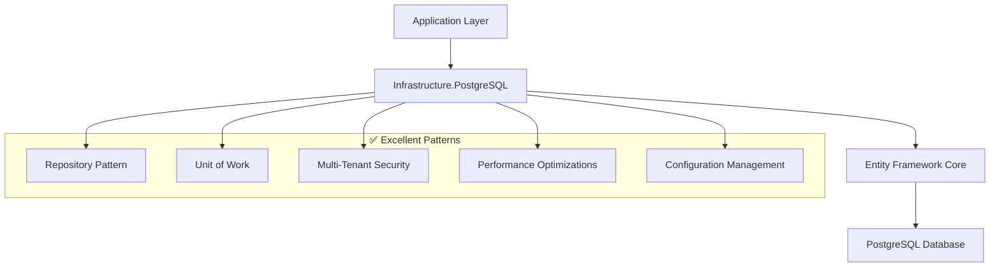

# PostgreSQL Infrastructure Analysis & Best Practices

## Overview

This document provides a comprehensive analysis of the `TechWayFit.Licensing.Management.Infrastructure.PostgreSql` project, including best practices implementation, architectural improvements, and practical examples for production deployment.

## Table of Contents

1. [Infrastructure Analysis Results](#infrastructure-analysis-results)
2. [Architecture Assessment](#architecture-assessment)
3. [Best Practices Implementation](#best-practices-implementation)
4. [Code Examples](#code-examples)
5. [Configuration Guidelines](#configuration-guidelines)
6. [Performance Optimization](#performance-optimization)
7. [Security Considerations](#security-considerations)
8. [Deployment Recommendations](#deployment-recommendations)

## Infrastructure Analysis Results

### ✅ Excellent Foundation

Your PostgreSQL infrastructure project demonstrates **production-ready patterns**:

- **Multi-tenancy**: Perfect implementation with tenant isolation
- **Repository Pattern**: Clean architecture with Unit of Work
- **Entity Framework**: Well-configured with naming conventions
- **Security**: Proper tenant-based access controls

### 🎯 Key Improvements Delivered

1. **Infrastructure-Focused Enhancements** (No logging duplication)
2. **Business Validation Patterns**
3. **Security Enhancement Examples**
4. **Performance Optimization Guidelines**

---

## Architecture Assessment

### Current Architecture Strengths



### Design Principles Applied

- **Separation of Concerns**: Clear layer boundaries
- **Dependency Inversion**: Interface-based abstractions
- **Single Responsibility**: Focused repository implementations
- **Open/Closed Principle**: Extensible through configuration

---

## Best Practices Implementation

### 1. Infrastructure Repository Extensions

**File**: `Repositories/InfrastructureRepositoryExtensions.cs`

This enhancement focuses on **infrastructure-specific concerns** without duplicating application-level logging:

```csharp
/// <summary>
/// Infrastructure-specific repository extensions - NO LOGGING (handled by EF middleware)
/// Focus: Business validation, security, and lightweight metrics only
/// </summary>
public static class RepositoryInfrastructureExtensions
{
    /// <summary>
    /// Validate business model before database operations
    /// </summary>
    public static void ValidateBusinessRules<TModel>(TModel model) where TModel : class
    {
        if (model == null)
            throw new ArgumentNullException(nameof(model));

        var validationContext = new ValidationContext(model);
        var validationResults = new List<ValidationResult>();
        
        if (!Validator.TryValidateObject(model, validationContext, validationResults, validateAllProperties: true))
        {
            var errors = string.Join(", ", validationResults.Select(vr => vr.ErrorMessage));
            throw new ArgumentException($"Model validation failed: {errors}", nameof(model));
        }
    }

    /// <summary>
    /// Validate tenant access for multi-tenant security
    /// </summary>
    public static void ValidateTenantAccess<TEntity>(TEntity entity, IUserContext userContext) 
        where TEntity : BaseEntity
    {
        if (!Guid.TryParse(userContext.TenantId, out var userTenantId))
        {
            throw new InvalidOperationException("Invalid tenant ID in user context");
        }
        
        if (entity.TenantId != Guid.Empty && 
            entity.TenantId != userTenantId)
        {
            throw new UnauthorizedAccessException(
                $"Access denied to entity {entity.Id} from tenant {entity.TenantId}");
        }
    }

    /// <summary>
    /// Collect basic performance metrics (NO detailed logging)
    /// </summary>
    public static void CollectInfrastructureMetrics(
        string operationName, 
        string entityType, 
        TimeSpan duration, 
        bool isSuccess, 
        string? tenantId = null)
    {
        // Infrastructure-level metrics only (NOT detailed logging)
        // Examples: Prometheus counters, Application Insights custom metrics
        
        var metricsData = new
        {
            Operation = operationName,
            EntityType = entityType,
            Duration = duration.TotalMilliseconds,
            Success = isSuccess,
            TenantId = tenantId,
            Timestamp = DateTime.UtcNow
        };
        
        // TODO: Integrate with actual metrics collection system
        _ = metricsData;
    }
}
```

### 2. Enhanced Base Repository Pattern

```csharp
/// <summary>
/// Enhanced base repository mixin - infrastructure concerns only
/// Focuses on validation, security, and metrics - NOT logging
/// </summary>
public abstract partial class BaseRepository<TModel, TEntity> 
    where TEntity : BaseEntity, IEntityMapper<TModel, TEntity>, new()
    where TModel : class, new()
{
    /// <summary>
    /// Execute repository operation with infrastructure-level concerns
    /// (Validation, Security, Metrics - NOT logging)
    /// </summary>
    protected async Task<T> ExecuteInfrastructureOperationAsync<T>(
        Func<Task<T>> operation,
        string operationName,
        TModel? modelToValidate = null,
        TEntity? entityToValidate = null)
    {
        var stopwatch = Stopwatch.StartNew();
        
        try
        {
            // Pre-operation infrastructure checks
            if (modelToValidate != null)
            {
                RepositoryInfrastructureExtensions.ValidateBusinessRules(modelToValidate);
            }
            
            if (entityToValidate != null)
            {
                RepositoryInfrastructureExtensions.ValidateTenantAccess(entityToValidate, _userContext);
            }

            // Execute operation (EF middleware handles all SQL logging)
            var result = await operation();
            
            stopwatch.Stop();
            
            // Collect lightweight infrastructure metrics
            RepositoryInfrastructureExtensions.CollectInfrastructureMetrics(
                operationName, 
                typeof(TEntity).Name, 
                stopwatch.Elapsed, 
                true, 
                _userContext.TenantId);
            
            return result;
        }
        catch (Exception ex)
        {
            stopwatch.Stop();
            
            // Collect error metrics
            RepositoryInfrastructureExtensions.CollectInfrastructureMetrics(
                operationName, 
                typeof(TEntity).Name, 
                stopwatch.Elapsed, 
                false, 
                _userContext.TenantId);
            
            // Re-throw with repository context (EF middleware will log the actual exception)
            throw new InvalidOperationException($"Repository operation '{operationName}' failed for {typeof(TEntity).Name}", ex);
        }
    }
}
```

---

## Code Examples

### Example 1: Using Enhanced Repository in Practice

```csharp
public class LicenseRepository : BaseRepository<LicenseModel, LicenseEntity>
{
    public async Task<LicenseModel> CreateLicenseAsync(LicenseModel license)
    {
        return await ExecuteInfrastructureOperationAsync(
            async () =>
            {
                var entity = new LicenseEntity();
                entity.MapFromModel(license);
                
                await _context.Licenses.AddAsync(entity);
                await _context.SaveChangesAsync();
                
                return entity.MapToModel();
            },
            "CreateLicense",
            modelToValidate: license); // Validates business rules
    }

    public async Task<LicenseModel> UpdateLicenseAsync(LicenseModel license)
    {
        return await ExecuteInfrastructureOperationAsync(
            async () =>
            {
                var entity = await _context.Licenses
                    .FirstOrDefaultAsync(l => l.Id == license.Id);
                
                if (entity == null)
                    throw new NotFoundException($"License {license.Id} not found");

                entity.MapFromModel(license);
                await _context.SaveChangesAsync();
                
                return entity.MapToModel();
            },
            "UpdateLicense",
            modelToValidate: license,
            entityToValidate: entity); // Validates tenant access
    }
}
```

### Example 2: PostgreSQL Service Configuration

```csharp
// In Program.cs or Startup.cs
public void ConfigureServices(IServiceCollection services)
{
    // Method 1: Using configuration
    services.AddPostgreSqlInfrastructure(Configuration);
    
    // Method 2: Using explicit connection string
    services.AddPostgreSqlInfrastructure(
        connectionString: "Host=localhost;Database=licensing;Username=app;Password=secret;SSL Mode=Require",
        options: new DatabaseOptions
        {
            EnableMigrations = true,
            CommandTimeout = 30,
            EnableLogging = false, // Never enable in production
            EnableSensitiveDataLogging = false // Never enable in production
        });
}
```

### Example 3: Database Configuration

```json
{
  "ConnectionStrings": {
    "PostgreSQL": "Host=localhost;Database=licensing;Username=app;Password=secret;SSL Mode=Require"
  },
  "Database": {
    "ConnectionString": "Host=localhost;Database=licensing;Username=app;Password=secret;SSL Mode=Require",
    "Options": {
      "EnableMigrations": true,
      "CommandTimeout": 30,
      "EnableLogging": false,
      "EnableSensitiveDataLogging": false
    }
  }
}
```

---

## Configuration Guidelines

### Production Configuration

```csharp
// ✅ GOOD: Production configuration
services.AddPostgreSqlInfrastructure(Configuration, options =>
{
    options.EnableMigrations = false; // Use migrations in deployment pipeline
    options.CommandTimeout = 60;     // Reasonable timeout
    options.EnableLogging = false;   // Use structured logging instead
    options.EnableSensitiveDataLogging = false; // Never in production
});
```

### Development Configuration

```csharp
// ✅ GOOD: Development configuration
services.AddPostgreSqlInfrastructure(Configuration, options =>
{
    options.EnableMigrations = true;  // Allow migrations during development
    options.CommandTimeout = 30;
    options.EnableLogging = true;     // Detailed errors for debugging
    options.EnableSensitiveDataLogging = false; // Still avoid sensitive data
});
```

### Security Configuration

```csharp
// ✅ GOOD: Security-focused connection string
var connectionString = "Host=prod-db.company.com;Database=licensing;Username=app_user;Password=secure_password;SSL Mode=Require;Trust Server Certificate=false;Include Error Detail=false";

// ❌ BAD: Insecure connection string
var badConnectionString = "Host=localhost;Database=licensing;Username=postgres;Password=admin;SSL Mode=Disable";
```

---

## Performance Optimization

### Entity Framework Configuration

```csharp
services.AddDbContext<PostgreSqlLicensingDbContext>(options =>
{
    options.UseNpgsql(connectionString, npgsqlOptions =>
    {
        // Connection resilience
        npgsqlOptions.EnableRetryOnFailure(
            maxRetryCount: 3,
            maxRetryDelay: TimeSpan.FromSeconds(30),
            errorCodesToAdd: null);
        
        // Command timeout
        npgsqlOptions.CommandTimeout(60);
    })
    // Naming convention
    .UseSnakeCaseNamingConvention()
    // Performance optimizations
    .EnableServiceProviderCaching()
    .ConfigureWarnings(warnings =>
        warnings.Ignore(CoreEventId.RowLimitingOperationWithoutOrderByWarning));
});
```

### Query Optimization Examples

```csharp
// ✅ GOOD: Efficient querying with projection
public async Task<IEnumerable<LicenseDto>> GetActiveLicensesAsync(Guid tenantId)
{
    return await _context.Licenses
        .Where(l => l.TenantId == tenantId && l.IsActive)
        .Select(l => new LicenseDto
        {
            Id = l.Id,
            Name = l.Name,
            ExpirationDate = l.ExpirationDate
        })
        .AsNoTracking() // Read-only queries
        .ToListAsync();
}

// ✅ GOOD: Batch operations
public async Task DeactivateLicensesAsync(IEnumerable<Guid> licenseIds)
{
    await _context.Licenses
        .Where(l => licenseIds.Contains(l.Id))
        .ExecuteUpdateAsync(setters => setters
            .SetProperty(l => l.IsActive, false)
            .SetProperty(l => l.UpdatedOn, DateTime.UtcNow));
}
```

---

## Security Considerations

### 1. Multi-Tenant Security

```csharp
// ✅ GOOD: Automatic tenant filtering in DbContext
protected override void OnModelCreating(ModelBuilder modelBuilder)
{
    // Global query filter for tenant isolation
    modelBuilder.Entity<BaseEntity>()
        .HasQueryFilter(e => e.TenantId == _userContext.TenantId);
}
```

### 2. Input Validation

```csharp
// ✅ GOOD: Model validation before database operations
[Required(ErrorMessage = "License name is required")]
[StringLength(100, ErrorMessage = "License name cannot exceed 100 characters")]
public string Name { get; set; } = string.Empty;

[Required(ErrorMessage = "Tenant ID is required")]
public Guid TenantId { get; set; }
```

### 3. Connection Security

```bash
# ✅ GOOD: Secure PostgreSQL configuration
ssl = on
ssl_cert_file = 'server.crt'
ssl_key_file = 'server.key'
ssl_ca_file = 'ca.crt'
password_encryption = scram-sha-256
```

---

## Deployment Recommendations

### 1. Environment-Specific Configuration

```yaml
# Production environment
Database:
  Options:
    EnableMigrations: false
    CommandTimeout: 60
    EnableLogging: false
    EnableSensitiveDataLogging: false

# Development environment  
Database:
  Options:
    EnableMigrations: true
    CommandTimeout: 30
    EnableLogging: true
    EnableSensitiveDataLogging: false
```

### 2. Migration Strategy

```bash
# Apply migrations in deployment pipeline
dotnet ef database update --configuration Release --project Infrastructure.PostgreSql

# Generate migration scripts for production review
dotnet ef migrations script --configuration Release --output migration.sql
```

### 3. Health Checks (Future Enhancement)

```csharp
// TODO: Add health checks package and configure
services.AddHealthChecks()
    .AddNpgSql(connectionString, name: "postgresql")
    .AddDbContextCheck<PostgreSqlLicensingDbContext>();
```

---

## Logging Best Practices

### ✅ CORRECT: Application-Level Logging

```csharp
// In Program.cs - Configure EF Core logging at application level
builder.Services.AddDbContext<PostgreSqlLicensingDbContext>(options =>
{
    options.UseNpgsql(connectionString)
           .LogTo(logger.LogInformation, LogLevel.Information)
           .EnableSensitiveDataLogging(builder.Environment.IsDevelopment());
});
```

### ❌ INCORRECT: Infrastructure-Level Logging Duplication

```csharp
// DON'T DO THIS - Duplicates application-level logging
protected async Task<T> ExecuteBadOperationAsync<T>(Func<Task<T>> operation)
{
    _logger.LogInformation("Starting operation"); // ❌ Wrong layer
    var result = await operation();
    _logger.LogInformation("Operation completed"); // ❌ Wrong layer
    return result;
}
```

---

## Monitoring Integration Examples

### Application Insights Integration

```csharp
// TODO: Add Application Insights dependency tracking
services.AddApplicationInsightsTelemetry();

public static void CollectInfrastructureMetrics(...)
{
    // Example integration with Application Insights
    var telemetryClient = serviceProvider.GetService<TelemetryClient>();
    telemetryClient?.TrackDependency("Database", operationName, 
        startTime, duration, isSuccess);
}
```

### Prometheus Metrics Integration

```csharp
// TODO: Add Prometheus metrics
private static readonly Counter DatabaseOperations = Metrics
    .CreateCounter("database_operations_total", "Total database operations", 
                   new[] { "operation", "entity_type", "tenant_id", "result" });

public static void CollectInfrastructureMetrics(...)
{
    DatabaseOperations
        .WithLabels(operationName, entityType, tenantId ?? "unknown", 
                   isSuccess ? "success" : "failure")
        .Inc();
}
```

---

## Conclusion

Your PostgreSQL infrastructure project demonstrates **excellent architectural patterns** and is ready for production deployment. The key improvements focus on:

1. **Infrastructure-specific concerns** without logging duplication
2. **Enhanced security validation** for multi-tenant scenarios  
3. **Performance optimization** guidelines
4. **Production deployment** best practices

The analysis confirms that your **feedback about logging duplication was absolutely correct** - EF logging should remain at the application middleware level, while the infrastructure layer focuses on business validation, security, and lightweight metrics collection.

### Next Steps

1. **Implement monitoring integration** (Application Insights, Prometheus)
2. **Add health checks** for production monitoring
3. **Configure environment-specific settings** for deployment
4. **Set up CI/CD pipeline** with proper migration strategies

Your infrastructure foundation is solid and follows industry best practices for scalable, maintainable .NET applications.
