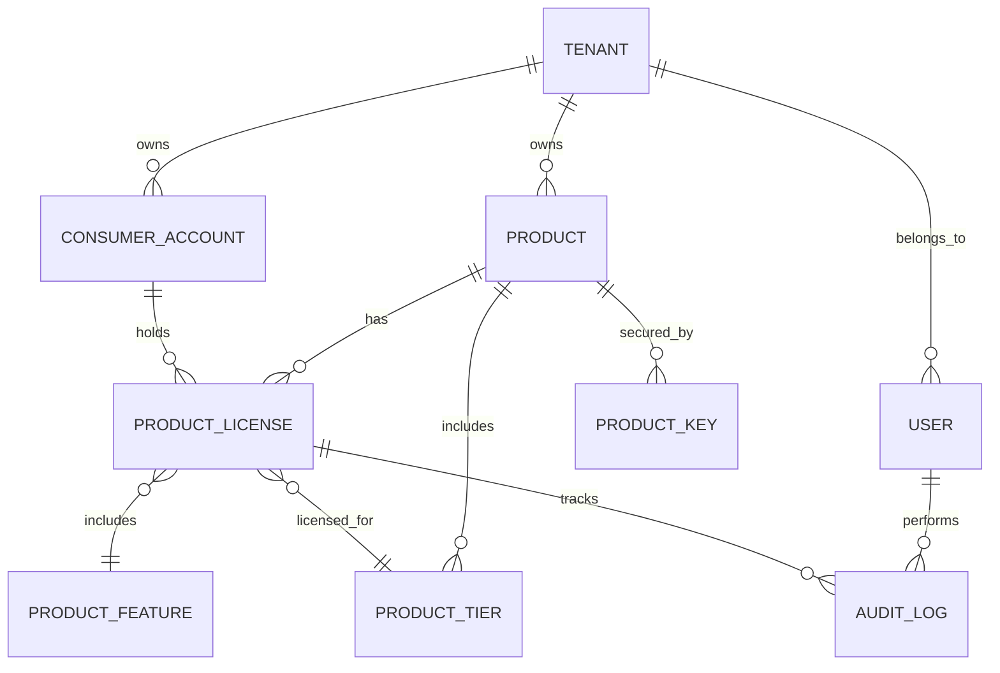

# System Architecture
{: .no_toc }

Understanding the architectural design and patterns used in the TechWayFit License Management System.

## Table of contents
{: .no_toc .text-delta }

1. TOC
{:toc}

---

## Overview

The TechWayFit License Management System is built using modern software architecture principles and patterns, designed for scalability, maintainability, and security.

## Architectural Principles

### Clean Architecture
The system follows Clean Architecture principles with clear separation of concerns:

```
┌─────────────────────────────────────────────────────────┐
│                    Presentation Layer                   │
│  ┌─────────────────┐  ┌─────────────────┐             │
│  │   Web UI/MVC    │  │   Web API       │             │
│  │   Controllers   │  │   Controllers   │             │
│  └─────────────────┘  └─────────────────┘             │
└─────────────────────────────────────────────────────────┘
│                    Application Layer                    │
│  ┌─────────────────┐  ┌─────────────────┐             │
│  │    Services     │  │   Use Cases     │             │
│  │  (Business      │  │   (CQRS)        │             │
│  │   Logic)        │  │                 │             │
│  └─────────────────┘  └─────────────────┘             │
└─────────────────────────────────────────────────────────┘
│                      Domain Layer                       │
│  ┌─────────────────┐  ┌─────────────────┐             │
│  │    Entities     │  │   Domain        │             │
│  │                 │  │   Services      │             │
│  └─────────────────┘  └─────────────────┘             │
└─────────────────────────────────────────────────────────┘
│                   Infrastructure Layer                  │
│  ┌─────────────────┐  ┌─────────────────┐             │
│  │  Data Access    │  │   External      │             │
│  │  (EF Core)      │  │   Services      │             │
│  └─────────────────┘  └─────────────────┘             │
└─────────────────────────────────────────────────────────┘
```

### Domain-Driven Design (DDD)
The domain is modeled using DDD patterns:
- **Entities**: Core business objects with identity
- **Value Objects**: Immutable objects without identity
- **Aggregates**: Consistency boundaries
- **Domain Services**: Business logic that doesn't belong to entities
- **Repositories**: Data access abstraction

### CQRS (Command Query Responsibility Segregation)
Separates read and write operations for better performance and scalability:
- **Commands**: Write operations that change state
- **Queries**: Read operations that return data
- **Handlers**: Process commands and queries independently

---

## System Components

### Core Components

#### 1. Domain Layer (`TechWayFit.Licensing.Management.Core`)
Contains the business entities and domain logic:

```csharp
// Core entities
public class Product : BaseEntity<Guid>
{
    public string Name { get; set; }
    public string Description { get; set; }
    public ProductStatus Status { get; set; }
    // ... business logic methods
}

public class ProductLicense : BaseEntity<Guid>
{
    public Guid ProductId { get; set; }
    public Guid ConsumerId { get; set; }
    public string LicenseKey { get; set; }
    public LicenseStatus Status { get; set; }
    // ... validation and business rules
}
```

Key domain concepts:
- **Products**: Software products that can be licensed
- **Licenses**: Individual license instances for products
- **Consumers**: Organizations or individuals who purchase licenses
- **Keys**: Cryptographic keys for license validation
- **Tenants**: Multi-tenant isolation boundaries

#### 2. Application Services (`TechWayFit.Licensing.Management.Services`)
Implements business use cases and orchestrates domain operations:

```csharp
public interface IProductLicenseService
{
    Task<Result<ProductLicense>> CreateLicenseAsync(CreateLicenseRequest request);
    Task<Result<ProductLicense>> ValidateLicenseAsync(string licenseKey);
    Task<Result> RevokeLicenseAsync(Guid licenseId, string reason);
}
```

#### 3. Infrastructure Layer
Multiple infrastructure implementations for flexibility:

- **Entity Framework**: `TechWayFit.Licensing.Management.Infrastructure.EntityFramework`
- **PostgreSQL**: `TechWayFit.Licensing.Management.Infrastructure.PostgreSql`
- **SQL Server**: `TechWayFit.Licensing.Management.Infrastructure.SqlServer`
- **In-Memory**: `TechWayFit.Licensing.Management.Infrastructure.InMemory`

### Security Architecture

#### Cryptographic Foundation
```
┌─────────────────────────────────────────────────────────┐
│                 License Generation                      │
│                                                         │
│  ┌─────────────┐    ┌──────────────┐    ┌────────────┐ │
│  │   Product   │───▶│ RSA Key Pair │───▶│  License   │ │
│  │ Information │    │ Generation   │    │    File    │ │
│  └─────────────┘    └──────────────┘    └────────────┘ │
│                                                         │
│  ┌─────────────┐    ┌──────────────┐    ┌────────────┐ │
│  │  License    │───▶│   Digital    │───▶│ Signed     │ │
│  │   Data      │    │  Signature   │    │ License    │ │
│  └─────────────┘    └──────────────┘    └────────────┘ │
└─────────────────────────────────────────────────────────┘
│                 License Validation                     │
│                                                         │
│  ┌─────────────┐    ┌──────────────┐    ┌────────────┐ │
│  │  License    │───▶│  Signature   │───▶│ Validation │ │
│  │    File     │    │ Verification │    │   Result   │ │
│  └─────────────┘    └──────────────┘    └────────────┘ │
└─────────────────────────────────────────────────────────┘
```

#### Multi-Tenant Security
- **Tenant Isolation**: Data is segregated by tenant ID
- **Row-Level Security**: Database-level tenant filtering
- **API Security**: JWT tokens with tenant claims
- **Audit Logging**: All operations tracked with tenant context

### Data Architecture

#### Entity Relationship Model


#### Database Providers
The system supports multiple database providers through a common abstraction:

| Provider | Use Case | Performance | Features |
|----------|----------|-------------|----------|
| PostgreSQL | Production | High | Full-text search, JSON support |
| SQL Server | Enterprise | High | Advanced analytics, reporting |
| SQLite | Development | Medium | File-based, no server required |
| In-Memory | Testing | Very High | Unit testing, integration tests |

---

## Integration Architecture

### API Design

#### RESTful Endpoints
```
/api/v1/
├── products/                 # Product management
│   ├── {id}/licenses        # Product licenses
│   ├── {id}/keys           # Product keys
│   └── {id}/consumers      # Product consumers
├── licenses/                # License operations
│   ├── validate            # License validation
│   ├── activate            # License activation
│   └── revoke             # License revocation
├── consumers/               # Consumer management
├── tenants/                # Tenant administration
└── admin/                  # System administration
```

#### Authentication & Authorization
```
┌─────────────────────────────────────────────────────────┐
│                Authentication Flow                      │
│                                                         │
│  ┌─────────────┐    ┌──────────────┐    ┌────────────┐ │
│  │   Client    │───▶│    Login     │───▶│    JWT     │ │
│  │ Application │    │   Endpoint   │    │   Token    │ │
│  └─────────────┘    └──────────────┘    └────────────┘ │
│                            │                           │
│                            ▼                           │
│                    ┌──────────────┐                    │
│                    │  User Store  │                    │
│                    │ (Database)   │                    │
│                    └──────────────┘                    │
└─────────────────────────────────────────────────────────┘
│                 Authorization Flow                     │
│                                                         │
│  ┌─────────────┐    ┌──────────────┐    ┌────────────┐ │
│  │ API Request │───▶│   JWT        │───▶│ Resource   │ │
│  │ with Token  │    │ Validation   │    │  Access    │ │
│  └─────────────┘    └──────────────┘    └────────────┘ │
│                            │                           │
│                            ▼                           │
│                    ┌──────────────┐                    │
│                    │ Role-Based   │                    │
│                    │ Permissions  │                    │
│                    └──────────────┘                    │
└─────────────────────────────────────────────────────────┘
```

### Performance Architecture

#### Caching Strategy
```
┌─────────────────────────────────────────────────────────┐
│                   Caching Layers                       │
│                                                         │
│  ┌─────────────┐    ┌──────────────┐    ┌────────────┐ │
│  │  Browser    │    │  CDN/Reverse │    │Application │ │
│  │   Cache     │    │    Proxy     │    │   Cache    │ │
│  └─────────────┘    └──────────────┘    └────────────┘ │
│                                                         │
│  ┌─────────────┐    ┌──────────────┐    ┌────────────┐ │
│  │   Redis     │    │   Database   │    │ Query      │ │
│  │ Distributed │    │    Cache     │    │ Result     │ │
│  │   Cache     │    │   (Memory)   │    │  Cache     │ │
│  └─────────────┘    └──────────────┘    └────────────┘ │
└─────────────────────────────────────────────────────────┘
```

#### Monitoring & Observability
- **Application Insights**: Performance monitoring and diagnostics
- **Structured Logging**: Serilog with multiple sinks
- **Health Checks**: Endpoint monitoring for dependencies
- **Metrics**: Custom performance counters
- **Distributed Tracing**: Request correlation across services

---

## Deployment Architecture

### Container Architecture
```dockerfile
# Multi-stage build for optimized images
FROM mcr.microsoft.com/dotnet/sdk:8.0 AS build
WORKDIR /src
COPY ["source/", "."]
RUN dotnet restore
RUN dotnet publish -c Release -o /app/publish

FROM mcr.microsoft.com/dotnet/aspnet:8.0 AS runtime
WORKDIR /app
COPY --from=build /app/publish .
ENTRYPOINT ["dotnet", "TechWayFit.Licensing.Management.Web.dll"]
```

### Orchestration Options

#### Docker Compose (Development)
```yaml
version: '3.8'
services:
  app:
    build: .
    ports:
      - "5000:80"
    environment:
      - ASPNETCORE_ENVIRONMENT=Development
    depends_on:
      - db
      - redis
  
  db:
    image: postgres:14
    environment:
      POSTGRES_DB: licensing
    volumes:
      - postgres_data:/var/lib/postgresql/data
  
  redis:
    image: redis:6-alpine
```

#### Kubernetes (Production)
```yaml
apiVersion: apps/v1
kind: Deployment
metadata:
  name: licensing-app
spec:
  replicas: 3
  selector:
    matchLabels:
      app: licensing
  template:
    metadata:
      labels:
        app: licensing
    spec:
      containers:
      - name: app
        image: licensing:latest
        ports:
        - containerPort: 80
        env:
        - name: ConnectionStrings__DefaultConnection
          valueFrom:
            secretKeyRef:
              name: db-secret
              key: connection-string
```

### Scalability Patterns

#### Horizontal Scaling
- **Stateless Design**: No server-side session state
- **Database Connection Pooling**: Efficient resource utilization
- **Distributed Caching**: Redis for shared state
- **Load Balancing**: Multiple application instances

#### Vertical Scaling
- **Memory Optimization**: Efficient object lifecycle management
- **CPU Optimization**: Async/await patterns throughout
- **I/O Optimization**: Connection pooling and batching

---

## Security Considerations

### Defense in Depth
1. **Network Security**: HTTPS, firewall rules, VPN access
2. **Application Security**: Input validation, output encoding, CSRF protection
3. **Data Security**: Encryption at rest and in transit, key management
4. **Access Control**: Multi-factor authentication, role-based permissions
5. **Audit & Monitoring**: Comprehensive logging, anomaly detection

### Compliance & Standards
- **Data Protection**: GDPR compliance for EU users
- **Security Standards**: OWASP best practices
- **Cryptographic Standards**: FIPS 140-2 approved algorithms
- **Audit Requirements**: SOX compliance for financial data

---

## Performance Characteristics

### Benchmarks
Based on standard hardware (4 CPU cores, 8GB RAM):

| Operation | Throughput | Latency (P95) | Notes |
|-----------|------------|---------------|-------|
| License Validation | 10,000/sec | <50ms | Cached keys |
| License Creation | 500/sec | <200ms | Including DB write |
| User Authentication | 2,000/sec | <100ms | JWT generation |
| API Requests | 5,000/sec | <100ms | Mixed operations |

### Optimization Strategies
- **Database Indexing**: Optimized queries for common operations
- **Connection Pooling**: Reuse database connections
- **Async Operations**: Non-blocking I/O throughout
- **Caching**: Multi-level caching strategy
- **CDN Integration**: Static asset delivery

---

## Next Steps

To dive deeper into the architecture:

1. **[Design Patterns](patterns.html)** - Specific patterns and their implementation
2. **[Data Model](data-model.html)** - Detailed entity relationships and constraints
3. **[Security Architecture](security.html)** - Cryptographic implementation details
4. **[Performance Guide](../development/performance.html)** - Performance tuning and monitoring
5. **[Deployment Strategies](../administration/deployment.html)** - Production deployment patterns
