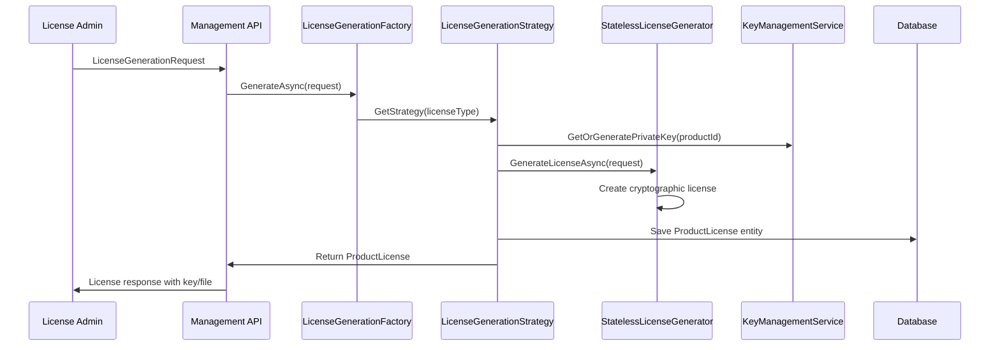
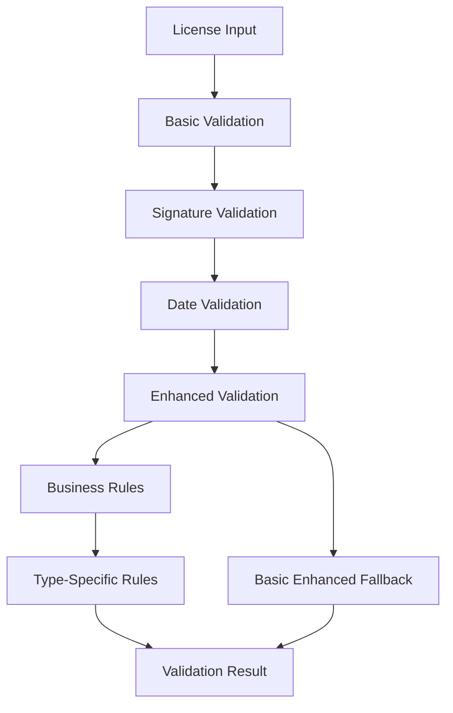
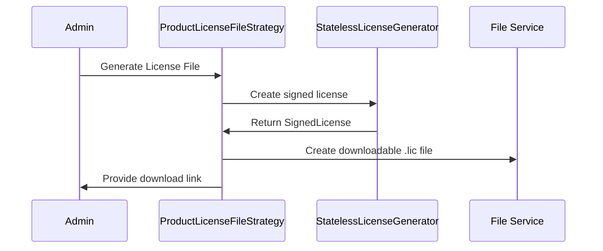
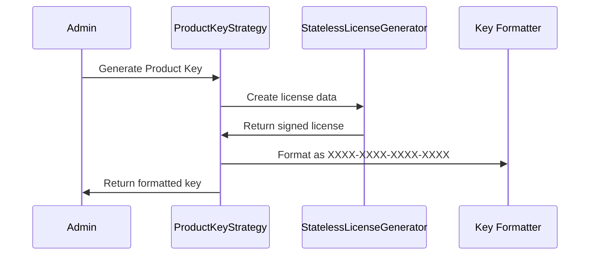
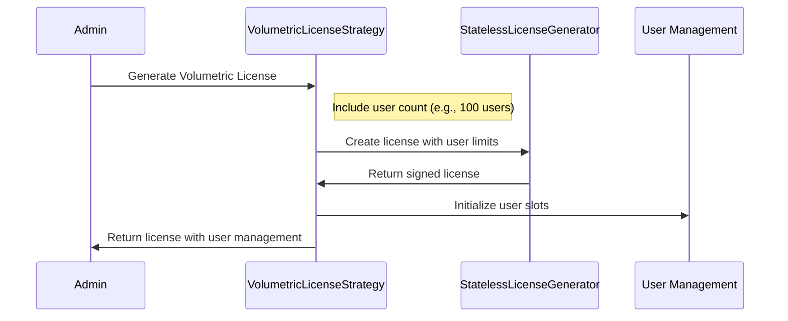

# How License Management Works - Complete System Guide

## Table of Contents
1. [System Overview](#system-overview)
2. [License Generation Architecture](#license-generation-architecture)
3. [License Validation Architecture](#license-validation-architecture)
4. [License Types and Their Workflows](#license-types-and-their-workflows)
5. [Core Components](#core-components)
6. [Security Model](#security-model)
7. [Validation Layers](#validation-layers)
8. [Usage Patterns and Examples](#usage-patterns-and-examples)
9. [Extension Points](#extension-points)
10. [Troubleshooting Guide](#troubleshooting-guide)

---

## System Overview

The TechWayFit License Management System is a comprehensive solution for generating, distributing, and validating software licenses. It supports multiple license types and provides both basic and enhanced validation capabilities.

### Key Characteristics
- **Multi-tier Architecture**: Separation of generation, storage, and validation concerns
- **Strategy Pattern Implementation**: Different license types handled by specialized strategies
- **Cryptographic Security**: RSA digital signatures for tamper-proof licensing
- **Flexible Validation**: Basic and enhanced validation with business rules
- **Extensible Design**: Easy addition of new license types and validation rules

### Supported License Types
1. **Product License Files** - Offline activation with downloadable files
2. **Product Keys** - Online activation with formatted keys
3. **Volumetric Licenses** - Multi-user licenses with usage limits

---

## License Generation Architecture

### High-Level Flow


### Core Generation Components

#### 1. LicenseGenerationFactory
**Location**: `source/services/TechWayFit.Licensing.Management.Services/Factories/LicenseGenerationFactory.cs`

**Responsibilities**:
- Strategy selection based on license type
- Centralized license generation coordination
- Strategy lifecycle management

**Key Methods**:
```csharp
ILicenseGenerationStrategy GetStrategy(LicenseType licenseType)
Task<ProductLicense> GenerateAsync(LicenseGenerationRequest request, string generatedBy)
IEnumerable<ILicenseGenerationStrategy> GetAllStrategies()
```

#### 2. License Generation Strategies
**Base Class**: `BaseLicenseGenerationStrategy`
**Location**: `source/services/TechWayFit.Licensing.Management.Services/Strategies/Base/`

**Strategy Pattern Implementation**:
- `ProductLicenseFileStrategy` - Generates downloadable license files
- `ProductKeyStrategy` - Generates formatted activation keys
- `VolumetricLicenseStrategy` - Generates multi-user licenses

**Generation Workflow**:
```csharp
public async Task<ProductLicense> GenerateAsync(LicenseGenerationRequest request, string generatedBy)
{
    // 1. Input validation
    ValidateRequest(request, generatedBy);
    
    // 2. Get or generate cryptographic keys
    var privateKey = await GetOrGeneratePrivateKeyAsync(request.ProductId);
    
    // 3. Create base license generation request
    var generationRequest = await CreateGenerationRequestAsync(request, privateKey);
    
    // 4. Type-specific customization
    await CustomizeGenerationRequestAsync(generationRequest, request);
    
    // 5. Generate cryptographically signed license
    var signedLicense = await _licenseGenerator.GenerateLicenseAsync(generationRequest);
    
    // 6. Create license entity
    var licenseEntity = await CreateLicenseEntityAsync(request, signedLicense, generationRequest, generatedBy);
    
    // 7. Type-specific post-processing
    await PostProcessLicenseAsync(licenseEntity, request, signedLicense);
    
    // 8. Save to repository
    return await _unitOfWork.Licenses.AddAsync(licenseEntity);
}
```

#### 3. StatelessLicenseGenerator
**Location**: `source/core/TechWayFit.Licensing.Generator/Services/StatelessLicenseGenerator.cs`

**Responsibilities**:
- Pure cryptographic license generation
- RSA digital signature creation
- License format standardization
- No state storage (stateless operations)

**Security Features**:
- RSA-2048 key pair generation
- SHA-256 digital signatures
- Base64 encoding for transport
- Tamper-proof license structure

#### 4. KeyManagementService
**Responsibilities**:
- Product-specific RSA key pair management
- Secure key storage and retrieval
- Key rotation capabilities
- Public key distribution

---

## License Validation Architecture

### Validation Layers Overview


### Core Validation Components

#### 1. LicenseValidator (Core Validation)
**Location**: `source/services/TechWayFit.Licensing.Validation/Services/LicenseValidator.cs`

**Primary Responsibilities**:
- Cryptographic signature validation
- License date/time validation
- Basic license integrity checks
- Caching and performance optimization

**Validation Methods**:
```csharp
// Core validation methods
Task<LicenseValidationResult> ValidateAsync(SignedLicense signedLicense, LicenseValidationOptions options)
Task<LicenseValidationResult> ValidateFromJsonAsync(string licenseJson, LicenseValidationOptions options)
Task<LicenseValidationResult> ValidateFromConfigurationAsync(LicenseValidationOptions options)

// Feature and licensing queries
Task<bool> IsFeatureAvailableAsync(string featureName)
Task<List<string>> GetAvailableFeaturesAsync()
Task<bool> SupportsLicenseTierAsync(LicenseTier requiredTier)
Task<FeatureLimits> GetFeatureLimitsAsync(string featureName)
```

#### 2. LicenseValidationEnhancementService (Business Rules)
**Location**: `source/services/TechWayFit.Licensing.Management.Services/Implementations/License/LicenseValidationEnhancementService.cs`

**Enhanced Validation Capabilities**:
- Comprehensive business rules validation
- License type-specific validation
- Usage pattern analysis
- Expiration and renewal management
- Detailed violation reporting

**Enhanced Validation Flow**:
```csharp
public async Task<EnhancedLicenseValidationResult> ValidateWithEnhancedRulesAsync(ProductLicense license)
{
    var result = new EnhancedLicenseValidationResult();
    
    // Layer 1: Basic license properties validation
    await ValidateBasicLicensePropertiesAsync(license, result);
    
    // Layer 2: License type-specific validation
    await ValidateLicenseTypeSpecificRulesAsync(license, result);
    
    // Layer 3: Business rules validation
    await ValidateBusinessRulesAsync(license, result);
    
    // Layer 4: Usage and activation validation
    await ValidateUsageAndActivationAsync(license, result);
    
    // Layer 5: Expiration and renewal analysis
    await ValidateExpirationAndRenewalAsync(license, result);
    
    return result;
}
```

#### 3. ProductLicenseService Integration
**Location**: `source/services/TechWayFit.Licensing.Management.Services/Implementations/License/ProductLicenseService.cs`

**Integrated Validation Methods**:
```csharp
// Basic validation
Task<LicenseValidationResult> ValidateLicenseAsync(string licenseKey, Guid productId, bool checkActivation = true)

// Enhanced validation with business rules
Task<EnhancedLicenseValidationResult?> ValidateLicenseWithEnhancedRulesAsync(string licenseKey, Guid productId, bool includeDetailedAnalysis = true)

// Data validation
Task<ValidationResult> ValidateLicenseDataAsync(ProductLicense license)
Task<ValidationResult> ValidateLicenseGenerationRequestAsync(LicenseGenerationRequest request)
```

---

## License Types and Their Workflows

### 1. Product License Files (Offline Activation)

#### Generation Process:


#### Characteristics:
- **Format**: Self-contained .lic files
- **Activation**: Completely offline
- **Security**: Embedded public keys and signatures
- **Use Case**: Enterprise customers, air-gapped environments

#### Validation:
- Digital signature verification
- Embedded public key validation
- License date range checks
- Product-specific validation data

### 2. Product Keys (Online Activation)

#### Generation Process:


#### Characteristics:
- **Format**: XXXX-XXXX-XXXX-XXXX pattern
- **Activation**: Online validation required
- **Security**: Server-side signature verification
- **Use Case**: Standard software distribution

#### Validation:
- Online signature verification
- Server-side license lookup
- Real-time status checks
- Feature availability validation

### 3. Volumetric Licenses (Multi-User)

#### Generation Process:


#### Characteristics:
- **Format**: XXXX-XXXX-XXXX-NNNN (where NNNN = user count)
- **Activation**: Online with user slot management
- **Security**: User-based activation tracking
- **Use Case**: Team-based products, enterprise deployments

#### Validation:
- User slot availability checks
- Concurrent user limits
- Team membership validation
- Usage analytics and reporting

---

## Core Components

### 1. Database Entities

#### ProductLicense (Primary Entity)
```csharp
public class ProductLicense
{
    public Guid LicenseId { get; set; }
    public Guid ProductId { get; set; }
    public Guid ConsumerId { get; set; }
    public string LicenseKey { get; set; }
    public DateTime ValidFrom { get; set; }
    public DateTime ValidTo { get; set; }
    public LicenseStatus Status { get; set; }
    public LicenseType LicenseModel { get; set; }
    public int? MaxAllowedUsers { get; set; }
    public int? MaxAllowedDevices { get; set; }
    public string? LicenseSignature { get; set; }
    // Navigation properties...
}
```

#### Supporting Entities
- **Product**: Product information and configuration
- **Consumer**: License holder information
- **ProductTier**: Feature and limitation definitions
- **LicenseActivity**: Audit trail and usage tracking

### 2. Models and DTOs

#### LicenseGenerationRequest
```csharp
public class LicenseGenerationRequest
{
    public Guid ProductId { get; set; }
    public Guid ConsumerId { get; set; }
    public Guid? TierId { get; set; }
    public LicenseType LicenseModel { get; set; }
    public DateTime? ExpiryDate { get; set; }
    public int? MaxUsers { get; set; }
    public int? MaxDevices { get; set; }
    public string? ValidProductVersionFrom { get; set; }
    public string? ValidProductVersionTo { get; set; }
    // Additional configuration...
}
```

#### EnhancedLicenseValidationResult
```csharp
public class EnhancedLicenseValidationResult
{
    public bool IsValid { get; set; }
    public List<string> ValidationMessages { get; set; }
    public List<string> Warnings { get; set; }
    public List<string> BusinessRuleViolations { get; set; }
    public bool IsExpired { get; set; }
    public bool RequiresRenewal { get; set; }
    public int DaysUntilExpiry { get; set; }
    public LicenseType LicenseType { get; set; }
    // Enhanced analysis properties...
}
```

### 3. Configuration Models

#### LicenseValidationOptions
```csharp
public class LicenseValidationOptions
{
    public bool ValidateSignature { get; set; } = true;
    public bool ValidateDates { get; set; } = true;
    public bool AllowGracePeriod { get; set; } = false;
    public int GracePeriodDays { get; set; } = 7;
    public bool EnableCaching { get; set; } = true;
    public int CacheDurationMinutes { get; set; } = 60;
    public bool StrictValidation { get; set; } = true;
}
```

---

## Security Model

### 1. Cryptographic Foundation

#### RSA Key Management
- **Key Size**: RSA-2048 minimum
- **Key Storage**: Secure key management service
- **Key Rotation**: Automated key lifecycle management
- **Key Distribution**: Public key embedding and distribution

#### Digital Signatures
- **Algorithm**: RSA with SHA-256
- **Signature Format**: Base64 encoded
- **Verification**: Multi-layer signature validation
- **Tamper Detection**: Cryptographic integrity checks

### 2. License Security Features

#### Tamper Protection
```csharp
// License includes cryptographic verification
public class SignedLicense
{
    public string LicenseData { get; set; }      // Base64 encoded license
    public string Signature { get; set; }        // RSA signature
    public string PublicKeyThumbprint { get; set; } // Key identification
    public string Checksum { get; set; }         // Additional integrity check
    public string FormatVersion { get; set; }    // License format versioning
}
```

#### Validation Security
- **Offline Validation**: Embedded public keys for air-gapped environments
- **Online Validation**: Real-time server verification
- **Replay Protection**: Timestamp and nonce validation
- **Key Revocation**: Support for compromised key handling

### 3. Security Best Practices

#### License Generation
1. **Secure Key Generation**: Cryptographically secure random number generation
2. **Key Isolation**: Separate key pairs per product
3. **Audit Logging**: Complete generation audit trail
4. **Access Control**: Role-based license generation permissions

#### License Validation
1. **Signature Verification**: Always validate digital signatures
2. **Time Validation**: Check license validity periods
3. **Replay Detection**: Prevent license replay attacks
4. **Graceful Degradation**: Secure fallback mechanisms

---

## Validation Layers

### Layer 1: Basic License Properties
```csharp
private async Task ValidateBasicLicensePropertiesAsync(ProductLicense license, EnhancedLicenseValidationResult result)
{
    // Required field validation
    if (license.ProductId == Guid.Empty)
        result.BusinessRuleViolations.Add("License must have a valid Product ID");
    
    if (license.ConsumerId == Guid.Empty)
        result.BusinessRuleViolations.Add("License must have a valid Consumer ID");
    
    if (string.IsNullOrWhiteSpace(license.LicenseKey))
        result.BusinessRuleViolations.Add("License must have a valid License Key");
    
    // Date validation
    if (license.ValidFrom >= license.ValidTo)
        result.BusinessRuleViolations.Add("License ValidFrom date must be before ValidTo date");
}
```

### Layer 2: License Type-Specific Validation
```csharp
private async Task ValidateLicenseTypeSpecificRulesAsync(ProductLicense license, EnhancedLicenseValidationResult result)
{
    switch (license.LicenseModel)
    {
        case LicenseType.ProductLicenseFile:
            if (string.IsNullOrWhiteSpace(license.LicenseSignature))
                result.BusinessRuleViolations.Add("ProductLicenseFile must have a digital signature");
            break;
            
        case LicenseType.VolumetricLicense:
            if (!license.MaxAllowedUsers.HasValue || license.MaxAllowedUsers <= 0)
                result.BusinessRuleViolations.Add("VolumetricLicense must specify MaxAllowedUsers greater than 0");
            break;
            
        case LicenseType.ProductKey:
            // Validate key format
            if (!IsValidProductKeyFormat(license.LicenseKey))
                result.BusinessRuleViolations.Add("ProductKey must follow XXXX-XXXX-XXXX-XXXX format");
            break;
    }
}
```

### Layer 3: Business Rules Validation
```csharp
private async Task ValidateBusinessRulesAsync(ProductLicense license, EnhancedLicenseValidationResult result)
{
    // Check for duplicate licenses
    var duplicateCount = await _productLicenseRepository.CountByLicenseKeyAsync(license.LicenseKey);
    if (duplicateCount > 1)
        result.BusinessRuleViolations.Add($"Duplicate license key detected ({duplicateCount} instances)");
    
    // Validate status consistency
    if (license.Status == LicenseStatus.Active && DateTime.UtcNow > license.ValidTo)
        result.BusinessRuleViolations.Add("License status is Active but the license has expired");
    
    // Product existence validation
    var product = await _productRepository.GetByIdAsync(license.ProductId);
    if (product == null)
        result.BusinessRuleViolations.Add("Referenced product does not exist");
}
```

### Layer 4: Usage and Activation Validation
```csharp
private async Task ValidateUsageAndActivationAsync(ProductLicense license, EnhancedLicenseValidationResult result)
{
    // User limit validation for volumetric licenses
    if (license.LicenseModel == LicenseType.VolumetricLicense)
    {
        var currentUsers = await GetActiveUserCountAsync(license.LicenseId);
        if (license.MaxAllowedUsers.HasValue && currentUsers > license.MaxAllowedUsers.Value)
        {
            result.BusinessRuleViolations.Add($"User count ({currentUsers}) exceeds license limit ({license.MaxAllowedUsers})");
        }
    }
    
    // Device limit validation
    if (license.MaxAllowedDevices.HasValue)
    {
        var currentDevices = await GetActiveDeviceCountAsync(license.LicenseId);
        if (currentDevices > license.MaxAllowedDevices.Value)
        {
            result.BusinessRuleViolations.Add($"Device count ({currentDevices}) exceeds license limit ({license.MaxAllowedDevices})");
        }
    }
}
```

### Layer 5: Expiration and Renewal Analysis
```csharp
private async Task ValidateExpirationAndRenewalAsync(ProductLicense license, EnhancedLicenseValidationResult result)
{
    var now = DateTime.UtcNow;
    var daysUntilExpiry = (license.ValidTo - now).Days;
    result.DaysUntilExpiry = daysUntilExpiry;
    
    if (daysUntilExpiry <= 0)
    {
        result.IsExpired = true;
        result.Warnings.Add("License has expired");
    }
    else if (daysUntilExpiry <= 7)
    {
        result.RequiresUrgentRenewal = true;
        result.Warnings.Add($"License expires in {daysUntilExpiry} day(s) - urgent renewal required");
    }
    else if (daysUntilExpiry <= 30)
    {
        result.RequiresRenewal = true;
        result.Warnings.Add($"License expires in {daysUntilExpiry} day(s) - renewal recommended");
    }
}
```

---

## Usage Patterns and Examples

### 1. License Generation Examples

#### Basic Product License Generation
```csharp
// Create a license generation request
var request = new LicenseGenerationRequest
{
    ProductId = Guid.Parse("12345678-1234-1234-1234-123456789012"),
    ConsumerId = Guid.Parse("87654321-4321-4321-4321-210987654321"),
    LicenseModel = LicenseType.ProductKey,
    ExpiryDate = DateTime.UtcNow.AddYears(1),
    MaxUsers = 10,
    MaxDevices = 5
};

// Generate the license
var productLicenseService = serviceProvider.GetService<IProductLicenseService>();
var license = await productLicenseService.GenerateLicenseAsync(request, "admin@company.com");

Console.WriteLine($"Generated License Key: {license.LicenseKey}");
```

#### Volumetric License Generation
```csharp
var volumetricRequest = new LicenseGenerationRequest
{
    ProductId = productId,
    ConsumerId = consumerId,
    LicenseModel = LicenseType.VolumetricLicense,
    ExpiryDate = DateTime.UtcNow.AddMonths(6),
    MaxUsers = 100  // Allow 100 concurrent users
};

var volumetricLicense = await productLicenseService.GenerateLicenseAsync(volumetricRequest, "license-admin");
```

### 2. License Validation Examples

#### Basic License Validation
```csharp
// Validate a license key
var licenseKey = "ABCD-EFGH-IJKL-MNOP";
var productId = Guid.Parse("12345678-1234-1234-1234-123456789012");

var validationResult = await productLicenseService.ValidateLicenseAsync(licenseKey, productId);

if (validationResult.IsValid)
{
    Console.WriteLine("License is valid");
    Console.WriteLine($"Available features: {string.Join(", ", validationResult.AvailableFeatures)}");
}
else
{
    Console.WriteLine($"License validation failed: {validationResult.Message}");
}
```

#### Enhanced License Validation
```csharp
// Perform enhanced validation with business rules
var enhancedResult = await productLicenseService.ValidateLicenseWithEnhancedRulesAsync(
    licenseKey, 
    productId, 
    includeDetailedAnalysis: true);

if (enhancedResult != null)
{
    Console.WriteLine($"License Valid: {enhancedResult.IsValid}");
    Console.WriteLine($"Days until expiry: {enhancedResult.DaysUntilExpiry}");
    
    if (enhancedResult.Warnings.Any())
    {
        Console.WriteLine("Warnings:");
        enhancedResult.Warnings.ForEach(w => Console.WriteLine($"  - {w}"));
    }
    
    if (enhancedResult.BusinessRuleViolations.Any())
    {
        Console.WriteLine("Business Rule Violations:");
        enhancedResult.BusinessRuleViolations.ForEach(v => Console.WriteLine($"  - {v}"));
    }
}
```

### 3. License File Validation (Offline)
```csharp
// Load and validate a license file
var licenseFileContent = await File.ReadAllTextAsync("license.lic");

var licenseValidator = serviceProvider.GetService<ILicenseValidator>();
var validationOptions = new LicenseValidationOptions
{
    ValidateSignature = true,
    ValidateDates = true,
    AllowGracePeriod = true,
    GracePeriodDays = 7
};

var fileValidationResult = await licenseValidator.ValidateFromJsonAsync(licenseFileContent, validationOptions);

if (fileValidationResult.IsValid)
{
    Console.WriteLine("License file is valid");
    Console.WriteLine($"Licensed to: {fileValidationResult.License?.LicensedTo}");
    Console.WriteLine($"Valid until: {fileValidationResult.License?.ValidTo:yyyy-MM-dd}");
}
```

### 4. Feature Availability Checking
```csharp
// Check if specific features are available
var licenseValidator = serviceProvider.GetService<ILicenseValidator>();

var hasAdvancedFeatures = await licenseValidator.IsFeatureAvailableAsync("AdvancedReporting");
var hasAPIAccess = await licenseValidator.IsFeatureAvailableAsync("APIAccess");

var availableFeatures = await licenseValidator.GetAvailableFeaturesAsync();
Console.WriteLine($"Available features: {string.Join(", ", availableFeatures)}");

// Check license tier support
var supportsEnterprise = await licenseValidator.SupportsLicenseTierAsync(LicenseTier.Enterprise);
```

### 5. Service Registration and Configuration
```csharp
// Register license services in dependency injection
services.AddScoped<ILicenseGenerationFactory, LicenseGenerationFactory>();
services.AddScoped<IProductLicenseService, ProductLicenseService>();
services.AddScoped<ILicenseValidator, LicenseValidator>();

// Register license generation strategies
services.AddScoped<ProductLicenseFileStrategy>();
services.AddScoped<ProductKeyStrategy>();
services.AddScoped<VolumetricLicenseStrategy>();

// Register enhanced validation service
services.AddEnhancedLicenseValidation(options =>
{
    options.EnableDetailedAnalysis = true;
    options.EnableUsageTracking = true;
    options.EnableBusinessRules = true;
});
```

---

## Extension Points

### 1. Adding New License Types

#### Step 1: Define License Type Enum
```csharp
public enum LicenseType
{
    ProductLicenseFile,
    ProductKey,
    VolumetricLicense,
    SubscriptionLicense,  // New type
    HardwareLicense       // New type
}
```

#### Step 2: Create License Generation Strategy
```csharp
public class SubscriptionLicenseStrategy : BaseLicenseGenerationStrategy
{
    public override LicenseType SupportedType => LicenseType.SubscriptionLicense;
    
    protected override async Task CustomizeGenerationRequestAsync(
        SimplifiedLicenseGenerationRequest generationRequest, 
        LicenseGenerationRequest request)
    {
        // Add subscription-specific customizations
        generationRequest.LicenseData["SubscriptionId"] = Guid.NewGuid().ToString();
        generationRequest.LicenseData["BillingCycle"] = "Monthly";
        // Additional subscription logic...
    }
    
    protected override async Task PostProcessLicenseAsync(
        ProductLicense license, 
        LicenseGenerationRequest request, 
        SignedLicense signedLicense)
    {
        // Set up subscription billing
        // Configure renewal schedules
        // Initialize usage tracking
    }
    
    public override Dictionary<string, object> GetRecommendedSettings()
    {
        return new Dictionary<string, object>
        {
            { "DefaultSubscriptionLength", TimeSpan.FromDays(30) },
            { "AutoRenewal", true },
            { "BillingNotificationDays", 7 }
        };
    }
}
```

#### Step 3: Register New Strategy
```csharp
// In LicenseGenerationFactory constructor
_strategyTypes = new Dictionary<LicenseType, Type>
{
    { LicenseType.ProductLicenseFile, typeof(ProductLicenseFileStrategy) },
    { LicenseType.ProductKey, typeof(ProductKeyStrategy) },
    { LicenseType.VolumetricLicense, typeof(VolumetricLicenseStrategy) },
    { LicenseType.SubscriptionLicense, typeof(SubscriptionLicenseStrategy) } // Add new strategy
};
```

### 2. Adding Custom Validation Rules

#### Create Custom Validation Strategy
```csharp
public class SubscriptionValidationStrategy : ILicenseValidationStrategy
{
    public LicenseType SupportedLicenseType => LicenseType.SubscriptionLicense;
    
    public async Task<LicenseValidationResult> ValidateAsync(License license, LicenseValidationOptions options)
    {
        // Subscription-specific validation logic
        var result = LicenseValidationResult.Success(license);
        
        // Check subscription status
        if (await IsSubscriptionCancelled(license.LicenseId))
        {
            result = LicenseValidationResult.Failure(LicenseStatus.Revoked, "Subscription has been cancelled");
        }
        
        // Check payment status
        if (await HasUnpaidInvoices(license.LicenseId))
        {
            result.AddMessage("Warning: Unpaid invoices may affect license validity");
        }
        
        return result;
    }
    
    public async Task<LicenseValidationResult> ValidateBusinessRulesAsync(License license)
    {
        // Subscription business rules
        // Payment verification
        // Usage limits
        // Billing cycle validation
    }
}
```

### 3. Extending Enhanced Validation

#### Add Custom Business Rules
```csharp
public class CustomLicenseValidationEnhancementService : LicenseValidationEnhancementService
{
    public CustomLicenseValidationEnhancementService(
        IProductLicenseRepository productLicenseRepository,
        IProductRepository productRepository,
        IConsumerAccountRepository consumerAccountRepository,
        ILogger<CustomLicenseValidationEnhancementService> logger)
        : base(productLicenseRepository, productRepository, consumerAccountRepository, logger)
    {
    }
    
    protected override async Task ValidateBusinessRulesAsync(ProductLicense license, EnhancedLicenseValidationResult result)
    {
        // Call base validation
        await base.ValidateBusinessRulesAsync(license, result);
        
        // Add custom business rules
        await ValidateCustomComplianceRules(license, result);
        await ValidateCustomUsagePatterns(license, result);
        await ValidateCustomSecurityRequirements(license, result);
    }
    
    private async Task ValidateCustomComplianceRules(ProductLicense license, EnhancedLicenseValidationResult result)
    {
        // GDPR compliance checks
        // SOX compliance validation
        // Industry-specific requirements
    }
}
```

### 4. Custom License File Formats

#### Extend ProductLicenseFileStrategy
```csharp
public class CustomLicenseFileStrategy : ProductLicenseFileStrategy
{
    protected override async Task PostProcessLicenseAsync(
        ProductLicense license, 
        LicenseGenerationRequest request, 
        SignedLicense signedLicense)
    {
        // Call base processing
        await base.PostProcessLicenseAsync(license, request, signedLicense);
        
        // Create custom file format
        var customFileContent = CreateCustomLicenseFile(license, signedLicense);
        await SaveCustomLicenseFile(license.LicenseId, customFileContent);
    }
    
    private string CreateCustomLicenseFile(ProductLicense license, SignedLicense signedLicense)
    {
        // Create XML, binary, or other custom format
        var customFormat = new
        {
            Header = new { Version = "2.0", Format = "CustomLicense" },
            License = signedLicense,
            Metadata = new { Generated = DateTime.UtcNow, Environment = "Production" },
            CustomFields = new { /* Custom license data */ }
        };
        
        return JsonSerializer.Serialize(customFormat, new JsonSerializerOptions { WriteIndented = true });
    }
}
```

---

## Troubleshooting Guide

### Common Issues and Solutions

#### 1. License Generation Failures

**Problem**: "Strategy for license type not found"
```
Strategy for license type 'ProductKey' not found
```

**Solution**: Ensure strategy is registered in DI container
```csharp
// In Startup.cs or Program.cs
services.AddScoped<ProductKeyStrategy>();
services.AddScoped<ProductLicenseFileStrategy>();
services.AddScoped<VolumetricLicenseStrategy>();
```

**Problem**: "Private key not found for product"
```
KeyManagementException: No private key found for product {ProductId}
```

**Solution**: Initialize keys for the product
```csharp
var keyManagementService = serviceProvider.GetService<IKeyManagementService>();
await keyManagementService.GenerateKeyPairAsync(productId);
```

#### 2. License Validation Failures

**Problem**: "Signature validation failed"
```
LicenseValidationResult: IsValid = false, Message = "Digital signature verification failed"
```

**Solution**: Check public key availability and license integrity
```csharp
// Verify public key is available
var publicKey = await keyManagementService.GetPublicKeyAsync(productId);
if (string.IsNullOrEmpty(publicKey))
{
    await keyManagementService.GenerateKeyPairAsync(productId);
}

// Verify license hasn't been tampered with
var licenseData = ExtractLicenseData(signedLicense);
var expectedSignature = CreateSignature(licenseData, privateKey);
```

**Problem**: "License dates invalid"
```
LicenseValidationResult: IsValid = false, Message = "License is not yet valid"
```

**Solution**: Check system clock and license date configuration
```csharp
// Verify system time is correct
var systemTime = DateTime.UtcNow;
var licenseValidFrom = license.ValidFrom;

// Allow for clock skew in validation options
var validationOptions = new LicenseValidationOptions
{
    AllowGracePeriod = true,
    GracePeriodDays = 1  // Allow 1 day grace for clock differences
};
```

#### 3. Performance Issues

**Problem**: Slow license validation
```
License validation taking >5 seconds per request
```

**Solution**: Enable caching and optimize database queries
```csharp
// Enable validation caching
var validationOptions = new LicenseValidationOptions
{
    EnableCaching = true,
    CacheDurationMinutes = 60
};

// Optimize database queries with includes
var license = await _productLicenseRepository
    .Include(l => l.LicenseConsumer)
        .ThenInclude(c => c.Product)
    .FirstOrDefaultAsync(l => l.LicenseKey == licenseKey);
```

**Problem**: Memory usage growing during validation
```
OutOfMemoryException during bulk license validation
```

**Solution**: Use pagination and streaming for bulk operations
```csharp
// Process licenses in batches
const int batchSize = 100;
var totalLicenses = await _repository.CountAsync();

for (int skip = 0; skip < totalLicenses; skip += batchSize)
{
    var licenses = await _repository
        .Skip(skip)
        .Take(batchSize)
        .ToListAsync();
    
    foreach (var license in licenses)
    {
        await ValidateLicenseAsync(license);
    }
    
    // Force garbage collection between batches
    GC.Collect();
}
```

#### 4. Configuration Issues

**Problem**: "Enhanced validation service not available"
```
ValidateLicenseWithEnhancedRulesAsync returns basic validation only
```

**Solution**: Properly register enhanced validation service
```csharp
// Register enhanced validation service
services.AddScoped<LicenseValidationEnhancementService>();

// Or use extension method
services.AddEnhancedLicenseValidation();
```

**Problem**: Database connection issues
```
InvalidOperationException: Unable to resolve service for type 'IUnitOfWork'
```

**Solution**: Ensure database context and repositories are registered
```csharp
// Register Entity Framework context
services.AddDbContext<LicensingDbContext>(options =>
    options.UseSqlServer(connectionString));

// Register Unit of Work pattern
services.AddScoped<IUnitOfWork, UnitOfWork>();
```

### Logging and Monitoring

#### Enable Comprehensive Logging
```csharp
// In appsettings.json
{
  "Logging": {
    "LogLevel": {
      "Default": "Information",
      "TechWayFit.Licensing": "Debug",
      "TechWayFit.Licensing.Validation": "Trace"
    }
  }
}
```

#### Monitor License Operations
```csharp
// Custom metrics for monitoring
services.AddSingleton<IMetrics, LicenseMetrics>();

public class LicenseMetrics : IMetrics
{
    public void RecordLicenseGeneration(LicenseType type, TimeSpan duration)
    {
        // Record metrics for monitoring dashboard
    }
    
    public void RecordValidationAttempt(bool success, TimeSpan duration)
    {
        // Track validation performance
    }
}
```

### Health Checks

#### License System Health Check
```csharp
services.AddHealthChecks()
    .AddCheck<LicenseSystemHealthCheck>("license-system")
    .AddCheck<KeyManagementHealthCheck>("key-management")
    .AddCheck<ValidationServiceHealthCheck>("validation-service");

public class LicenseSystemHealthCheck : IHealthCheck
{
    public async Task<HealthCheckResult> CheckHealthAsync(HealthCheckContext context, CancellationToken cancellationToken = default)
    {
        try
        {
            // Test license generation
            var testLicense = await GenerateTestLicense();
            
            // Test license validation
            var validationResult = await ValidateTestLicense(testLicense);
            
            if (validationResult.IsValid)
                return HealthCheckResult.Healthy("License system operating normally");
            else
                return HealthCheckResult.Degraded("License validation issues detected");
        }
        catch (Exception ex)
        {
            return HealthCheckResult.Unhealthy("License system failure", ex);
        }
    }
}
```

This comprehensive guide covers the complete license management system, from generation to validation, including architecture, security, usage patterns, and troubleshooting. The system is designed to be extensible, secure, and maintainable while supporting multiple license types and validation scenarios.
