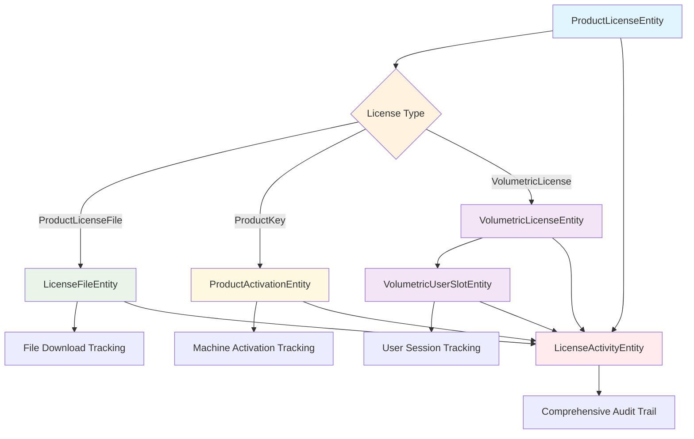
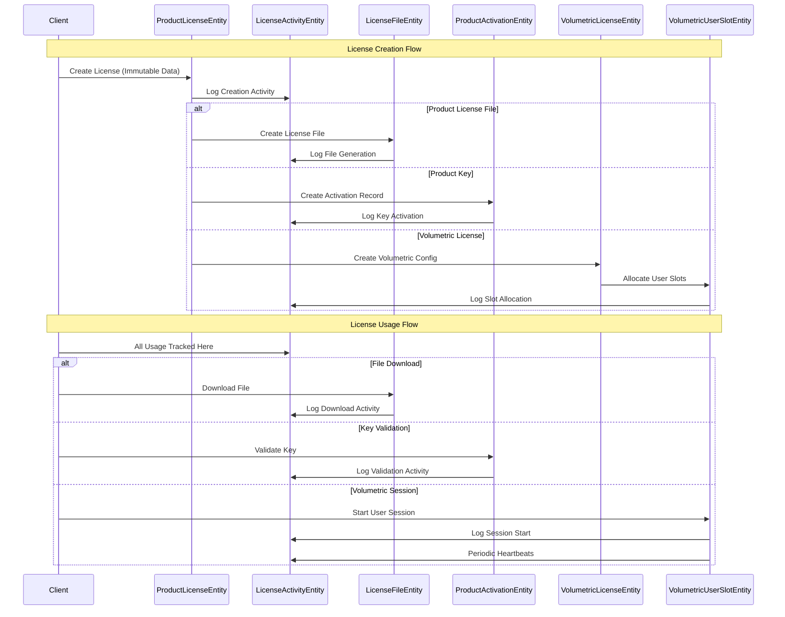

# License Management Entity Relationship Diagram

## Overview
This diagram shows the complete entity relationship model for the license management system, including the three license types and their supporting entities.

## Entity Relationship Diagram

```mermaid
erDiagram
    %% Core License Entity
    ProductLicenseEntity {
        uuid id PK
        uuid tenant_id FK
        string license_code
        uuid product_id FK
        uuid consumer_id FK
        uuid product_tier_id FK
        datetime valid_from
        datetime valid_to
        string valid_product_version_from
        string valid_product_version_to
        string encryption
        string signature
        string license_key
        string public_key
        string license_signature
        datetime key_generated_at
        string status
        string issued_by
        datetime revoked_at
        string revocation_reason
        string metadata_json
        enum license_type
        string formatted_product_key
        int max_activations
        string base_volumetric_key
        int max_concurrent_users
        int max_total_users
        boolean is_active
        boolean is_deleted
        string created_by
        datetime created_on
        string updated_by
        datetime updated_on
    }

    %% Activity Tracking Entity
    LicenseActivityEntity {
        uuid id PK
        uuid tenant_id FK
        uuid license_id FK
        enum activity_type
        string status
        datetime activity_timestamp
        string performed_by
        string description
        string activity_data
        string machine_id
        string machine_name
        string machine_fingerprint
        string ip_address
        string user_id
        int slot_number
        int current_activations
        int current_active_users
        int total_allocated_users
        int download_count
        string file_name
        long file_size_bytes
        string file_hash
        datetime session_start_time
        datetime session_end_time
        int session_duration_minutes
        datetime last_heartbeat
        boolean is_active
        boolean is_deleted
        string created_by
        datetime created_on
    }

    %% License File Management Entity
    LicenseFileEntity {
        uuid id PK
        uuid tenant_id FK
        uuid license_id FK
        string file_name
        string file_path
        long file_size_bytes
        string content_type
        string file_hash
        int download_count
        datetime last_downloaded_at
        string last_downloaded_by
        datetime expires_at
        int download_limit
        boolean is_download_enabled
        string file_version
        string file_type
        string encryption_method
        string file_metadata
        boolean is_active
        boolean is_deleted
        string created_by
        datetime created_on
    }

    %% Product Key Activation Entity
    ProductActivationEntity {
        uuid id PK
        uuid tenant_id FK
        uuid license_id FK
        string product_key
        string machine_id
        string machine_name
        string machine_fingerprint
        string ip_address
        datetime activation_date
        datetime last_heartbeat
        enum status
        string activation_data
        datetime deactivation_date
        string deactivation_reason
        string deactivated_by
        string application_version
        string operating_system
        string hardware_hash
        string last_known_version
        boolean is_active
        boolean is_deleted
        string created_by
        datetime created_on
    }

    %% Volumetric License Entity
    VolumetricLicenseEntity {
        uuid id PK
        uuid tenant_id FK
        uuid license_id FK
        string base_key
        int max_concurrent_users
        int max_total_users
        int current_active_users
        int total_allocated_users
        int auto_cleanup_inactive_hours
        string configuration_data
        int max_session_hours
        int heartbeat_interval_minutes
        int inactive_grace_period_minutes
        boolean is_active
        boolean is_deleted
        string created_by
        datetime created_on
    }

    %% Volumetric User Slot Entity
    VolumetricUserSlotEntity {
        uuid id PK
        uuid tenant_id FK
        uuid volumetric_license_id FK
        int slot_number
        string user_key
        string user_id
        string machine_id
        string machine_name
        string machine_fingerprint
        string ip_address
        datetime first_activation
        datetime last_activity
        boolean is_currently_active
        datetime current_session_start
        datetime last_heartbeat
        string activation_data
        string session_data
        string application_version
        string operating_system
        boolean is_active
        boolean is_deleted
        string created_by
        datetime created_on
    }

    %% Supporting Entities (External References)
    ProductEntity {
        uuid id PK
        string name
        string description
    }

    ConsumerAccountEntity {
        uuid id PK
        string name
        string email
    }

    ProductTierEntity {
        uuid id PK
        string name
        string description
    }

    TenantEntity {
        uuid tenant_id PK
        string name
    }

    %% Relationships
    ProductLicenseEntity ||--o{ LicenseActivityEntity : "tracks activities"
    ProductLicenseEntity ||--o{ LicenseFileEntity : "has files"
    ProductLicenseEntity ||--o{ ProductActivationEntity : "has activations"
    ProductLicenseEntity ||--o| VolumetricLicenseEntity : "has volumetric config"
    VolumetricLicenseEntity ||--o{ VolumetricUserSlotEntity : "contains user slots"
    
    ProductEntity ||--o{ ProductLicenseEntity : "licensed as"
    ConsumerAccountEntity ||--o{ ProductLicenseEntity : "owns licenses"
    ProductTierEntity ||--o{ ProductLicenseEntity : "defines tier"
    TenantEntity ||--o{ ProductLicenseEntity : "tenant isolation"
    TenantEntity ||--o{ LicenseActivityEntity : "tenant isolation"
    TenantEntity ||--o{ LicenseFileEntity : "tenant isolation"
    TenantEntity ||--o{ ProductActivationEntity : "tenant isolation"
    TenantEntity ||--o{ VolumetricLicenseEntity : "tenant isolation"
    TenantEntity ||--o{ VolumetricUserSlotEntity : "tenant isolation"
```



## License Type Specific Entity Usage



## Data Flow Architecture



## Entity Inheritance Hierarchy

```mermaid
classDiagram
    class AuditWorkflowEntity {
        <<abstract>>
        +Guid Id
        +Guid TenantId
        +bool IsActive
        +bool IsDeleted
        +string CreatedBy
        +DateTime CreatedOn
        +string UpdatedBy
        +DateTime UpdatedOn
        +string DeletedBy
        +DateTime DeletedOn
    }

    class ProductLicenseEntity {
        +string LicenseCode
        +Guid ProductId
        +Guid ConsumerId
        +LicenseType LicenseType
        +string LicenseKey
        +string PublicKey
        +string FormattedProductKey
        +string BaseVolumetricKey
        +int MaxActivations
        +int MaxConcurrentUsers
        +int MaxTotalUsers
        +ICollection~LicenseActivityEntity~ Activities
        +ICollection~LicenseFileEntity~ LicenseFiles
        +ICollection~ProductActivationEntity~ Activations
        +VolumetricLicenseEntity VolumetricLicense
    }

    class LicenseActivityEntity {
        +Guid LicenseId
        +LicenseActivityType ActivityType
        +string Status
        +DateTime ActivityTimestamp
        +string PerformedBy
        +string MachineId
        +string UserId
        +int SlotNumber
        +ProductLicenseEntity License
    }

    class LicenseFileEntity {
        +Guid LicenseId
        +string FileName
        +string FilePath
        +long FileSizeBytes
        +string FileHash
        +int DownloadCount
        +bool IsDownloadEnabled
        +ProductLicenseEntity License
    }

    class ProductActivationEntity {
        +Guid LicenseId
        +string ProductKey
        +string MachineId
        +ProductActivationStatus Status
        +DateTime ActivationDate
        +DateTime LastHeartbeat
        +ProductLicenseEntity License
    }

    class VolumetricLicenseEntity {
        +Guid LicenseId
        +string BaseKey
        +int MaxConcurrentUsers
        +int MaxTotalUsers
        +int CurrentActiveUsers
        +int TotalAllocatedUsers
        +ProductLicenseEntity License
        +ICollection~VolumetricUserSlotEntity~ UserSlots
    }

    class VolumetricUserSlotEntity {
        +Guid VolumetricLicenseId
        +int SlotNumber
        +string UserKey
        +string UserId
        +bool IsCurrentlyActive
        +DateTime LastActivity
        +VolumetricLicenseEntity VolumetricLicense
    }

    AuditWorkflowEntity <|-- ProductLicenseEntity
    AuditWorkflowEntity <|-- LicenseActivityEntity
    AuditWorkflowEntity <|-- LicenseFileEntity
    AuditWorkflowEntity <|-- ProductActivationEntity
    AuditWorkflowEntity <|-- VolumetricLicenseEntity
    AuditWorkflowEntity <|-- VolumetricUserSlotEntity

    ProductLicenseEntity ||--o{ LicenseActivityEntity
    ProductLicenseEntity ||--o{ LicenseFileEntity
    ProductLicenseEntity ||--o{ ProductActivationEntity
    ProductLicenseEntity ||--o| VolumetricLicenseEntity
    VolumetricLicenseEntity ||--o{ VolumetricUserSlotEntity
```

## Key Design Principles Illustrated

### 1. **Separation of Concerns**
- **ProductLicenseEntity**: Immutable core license data
- **LicenseActivityEntity**: All changeable tracking data
- **Specialized Entities**: Type-specific functionality

### 2. **Multi-Tenant Architecture**
- All entities include `tenant_id` for isolation
- Global query filters ensure tenant security

### 3. **Comprehensive Audit Trail**
- Every action tracked in `LicenseActivityEntity`
- Complete inheritance from `AuditWorkflowEntity`
- Machine fingerprinting for security

### 4. **Scalable Design**
- Activity table can be partitioned by time
- User slots support enterprise-scale (9999 users)
- Efficient indexing strategies per entity

### 5. **Type Safety**
- Enum-based type system (`LicenseType`, `LicenseActivityType`, `ProductActivationStatus`)
- Strong typing throughout the entity model
- Reduced magic strings and improved maintainability

This entity model provides a robust foundation for implementing all three license types while maintaining data integrity, performance, and comprehensive auditability.
